# Báo cáo đánh giá & lựa chọn mô hình AI

**Hệ thống:** FPTU Math AI — trợ giảng toán cho MAE101 / MAD101 / MAS291  
**Ngày chạy:** 15/07/2026  
**Phần cứng:** NVIDIA RTX PRO 6000 Blackwell Server Edition, 97887 MiB, 580.159.03  
**Phần mềm:** vLLM 0.10.2 · PyTorch 2.8.0+cu128 · driver 580 (CUDA 13.0)

> Toàn bộ số liệu trong báo cáo này được đo thực tế trên chính hạ tầng triển khai, không lấy từ tài liệu hay bảng xếp hạng của nhà sản xuất.

---

## Slide 0 — Kiến trúc hệ thống AI (Local RAG Pipeline)

```
  Tài liệu (PDF/DOCX)          Ngân hàng câu hỏi
        │                             │
        ├── OCR (RapidOCR) ───────────┤
        │                             │
        ▼                             ▼
   Chia đoạn (chunk)          Chuẩn hoá schema
        │                             │
        └──────────┬──────────────────┘
                   ▼
        Embedding — BAAI/bge-m3 (1024 chiều, vLLM :8001)
                   ▼
        PostgreSQL + pgvector  (VM riêng, nối qua SSH tunnel)
          ├── document_chunks     :  2,175 đoạn lý thuyết
          └── math_question_bank  : 14,512 bài đã giải
                   ▼
        Truy hồi (cosine, lọc theo môn) — top-3 lý thuyết + top-3 bài mẫu
                   ▼
        Prompt = System (đóng vai GV + CoT) + Ngữ cảnh + Câu hỏi
                   ▼
        LLM cục bộ — vLLM (OpenAI-compatible API)
                   ▼
        Hậu xử lý: bóc đáp án · kiểm định dạng · sympy đối chiếu
```

**Độ phủ corpus theo môn (đo từ DB thật):**

| Môn | Đoạn lý thuyết | Bài giải mẫu |
|---|---:|---:|
| MAE101 | 550 | 4,404 |
| MAD101 | 1,427 | 6,752 |
| MAS291 | 198 | 3,356 |

> ⚠️ Lý thuyết phân bố **không đều**: môn nhiều nhất gấp ~7 lần môn ít nhất. Đây là nguyên nhân gốc của phần lớn *Retrieval Error* ở mục phân tích lỗi.

---

## Slide 1 — 5 mô hình được so sánh

| | Model | Loại | Tham số | Vai trò trong thí nghiệm |
|---|---|---|---:|---|
| 1 | `Qwen/Qwen2.5-7B-Instruct` | Instruct (không suy luận) | 7.6B | Đối chứng cùng họ — LLM chỉ-dẫn thường, trả thẳng kết quả |
| 2 | `deepseek-ai/DeepSeek-R1-Distill-Qwen-7B` | Reasoning | 7.6B | Reasoning cỡ nhỏ, có chuỗi `<think>` |
| 3 | `deepseek-ai/DeepSeek-R1-Distill-Qwen-32B` | Reasoning | 32.8B | Reasoning cỡ lớn — cấu hình mạnh nhất chạy được trên hệ thống |
| 4 | `NousResearch/Meta-Llama-3.1-8B-Instruct` | Instruct (không suy luận) | 8.0B | Đối chứng khác họ — kiểm tra kết luận có tổng quát ngoài họ Qwen không |
| 5 | `deepseek-ai/DeepSeek-R1-Distill-Qwen-14B` | Reasoning | 14.8B | Reasoning **trung gian** — trả lời 'sao không chọn cỡ ở giữa?' |

### Vì sao chọn đúng những model này

**Hai đối chứng, không phải một.** `Qwen2.5-7B` khống chế biến kiến trúc: cả ba model DeepSeek-R1-Distill đều được chưng cất **từ chính Qwen**, nên khi so với Qwen2.5-7B thì chênh lệch quy về **đúng một biến — có suy luận hay không** (cùng kiến trúc, cùng tokenizer, cùng dữ liệu tiền huấn luyện). Nhưng chính vì cùng họ, nó **không** chứng minh được kết luận có đúng ngoài họ Qwen hay không → thêm `Llama-3.1-8B` khác hẳn nền. Nếu **cả hai** baseline cùng thua reasoning model thì luận điểm chắc hơn hẳn một baseline.

**Ba cỡ reasoning, không phải hai.** Chỉ có 7B và 32B thì kết luận "phải dùng 32B" mới là so hai điểm mút — hội đồng hỏi ngay *"sao không thử cỡ trung gian?"*. `R1-Distill-14B` cho biết đường cong chất lượng-theo-kích-thước bão hoà ở đâu. Nếu 14B đã đủ ngưỡng thì kết luận đúng phải là chọn 14B — rẻ hơn, nhanh hơn — và báo cáo này sẽ nói đúng như vậy.

> **Ghi chú về nguồn model:** dùng bản mirror `NousResearch/Meta-Llama-3.1-8B-Instruct` vì repo gốc `meta-llama/*` là *gated* (cần token đã được Meta duyệt). Đây là bản sao y nguyên trọng số, không phải bản fine-tune lại.

---

## Slide 2 — Thiết kế thí nghiệm & bảo đảm công bằng

| Hạng mục | Giá trị |
|---|---|
| Bộ câu hỏi | **hai bộ độc lập**: bộ gốc 180 câu (60/môn × 3 môn, easy/medium/hard) + bộ KHÓ 180 câu (medium 48 / hard 132) |
| Vấn đề 1 — ra đề | 27 lượt/model/chế độ |
| Vấn đề 2 — giải toán *(bộ gốc)* | 180 lượt/model/chế độ |
| Vấn đề 2 — giải toán *(bộ KHÓ)* | 180 lượt/model/chế độ |
| Vấn đề 3 — chấm bài | 139 lượt/model/chế độ |
| Tổng lượt sinh | **5,260** (526 tác vụ × 5 model × 2 chế độ) |
| Warm-up | 3 request/model trước khi đo |
| Concurrency — đo hiệu năng | **1** (nghiêm ngặt) |
| Concurrency — đo chất lượng | Qwen2.5-7B=16, R1-7B=16, R1-32B=12, Llama-3.1-8B=16, R1-14B=12 |
| Số lần lặp | 1 lượt/câu (seed cố định `20260715`) |
| Thứ tự chạy | cố định: model → chế độ → task theo ID |
| RAG corpus | **giống hệt nhau** cho cả 5 model |
| Ngữ cảnh RAG | **truy hồi trước 1 lần**, cả 5 model nhận cùng một chuỗi |
| Bố trí GPU | 3 pha (A: Qwen+R1-7B · A2: Llama+R1-14B · B: R1-32B riêng) |

### Vì sao tách hai pha concurrency (câu hỏi hội đồng sẽ hỏi)

- **Đo hiệu năng phải concurrency = 1.** Chạy song song thì request phải xếp hàng, TTFT đo được sẽ gồm cả thời gian chờ hàng đợi — không còn là độ nhạy của model.
- **Đo chất lượng thì concurrency không ảnh hưởng.** Mỗi request độc lập, tham số sinh cố định; chạy 8 luồng hay 1 luồng thì nội dung câu trả lời phân phối như nhau. Nhờ vậy tiết kiệm khoảng 9 giờ GPU mà không đánh đổi tính công bằng.

### Các biến nhiễu đã khử

- Ngữ cảnh RAG truy hồi **trước**, lưu ra file → thời gian embed + tìm kiếm không lọt vào TTFT, và mọi model đọc **cùng một** ngữ cảnh.
- Chỉ mục nằm trong RAM (numpy) thay vì gọi DB qua tunnel → loại biến động mạng.
- Không model nào dùng `--enforce-eager`: nếu chỉ 32B chạy eager thì nó bị bóp tốc độ 10–15% một cách giả tạo.
- Mọi model dùng **chung một System Prompt**.

---

## Slide 3 — Tham số cấu hình & lý do

| Model | Temperature | Top-P | Max tokens |
|---|---:|---:|---:|
| Qwen2.5-7B-Instruct (baseline, không suy luận) | 0.1 | 0.9 | 2,048 |
| DeepSeek-R1-Distill-Qwen-7B (suy luận, nhỏ) | 0.6 | 0.95 | 6,144 |
| DeepSeek-R1-Distill-Qwen-32B (suy luận, lớn) | 0.6 | 0.95 | 6,144 |
| Llama-3.1-8B-Instruct (baseline khác họ) | 0.1 | 0.9 | 2,048 |
| DeepSeek-R1-Distill-Qwen-14B (suy luận, trung gian) | 0.6 | 0.95 | 6,144 |

### Vì sao KHÔNG ép mọi model cùng temperature

Model card chính thức của DeepSeek-R1-Distill ghi rõ: temperature = 0 khiến model **lặp vô tận hoặc mất mạch lạc**, và khuyến nghị dải **0.5–0.7 (mặc định 0.6)** kèm top-p 0.95. Ép R1 về 0.1 là cố tình chạy sai khuyến nghị của nhà sản xuất → so sánh mất công bằng. Ngược lại Qwen2.5-Instruct là model chỉ-dẫn thường, chạy tốt ở temperature thấp và đó chính là cấu hình dùng khi triển khai thật.
→ **Mỗi model được chạy ở cấu hình tốt nhất của chính nó.** So sánh ở đây là "model ở trạng thái tốt nhất", không phải "model bị bóp cùng một tham số".

### Cách bảo vệ từng tham số trước hội đồng

- **Temperature thấp (Qwen 0.1 / R1 0.6):** dự án là giải toán, cần suy luận tất định theo định lý, không cần sáng tạo. Hạ nhiệt độ để triệt tiêu việc AI tự bịa số liệu. Với R1 thì 0.6 đã là mức thấp nhất còn *an toàn*.
- **Top-P 0.9–0.95:** giới hạn model vào nhóm token xác suất cao → các bước giải mạch lạc, không lan man sang từ ngữ xác suất thấp.
- **Max tokens 2.048 (Qwen) vs 6.144 (R1):** R1 cần không gian rất lớn để 'nháp' trong thẻ `<think>` trước khi chốt đáp án. Cấp cho Qwen 6.144 là vô nghĩa vì nó không có pha suy nghĩ. Tỉ lệ bị cắt (truncation) được đo và công bố ở dưới.
- **System Prompt:** đóng vai giáo viên toán FPT (Role-play) + bắt buộc suy luận từng bước (Chain-of-Thought) + cấm bịa định lý + bắt kiểm tra lại phép tính cuối.

---

## Slide 4 — So sánh hiệu năng (Latency & VRAM)

*Mọi số dưới đây lấy từ pha concurrency = 1.*

| Chỉ số | Qwen2.5-7B | R1-7B | R1-32B | Llama-3.1-8B | R1-14B |
|---|---:|---:|---:|---:|---:|
| Model Load Time (s) | 140 | 166 | 251 | 85 | 155 |
| **Trọng số model (GiB)** | 14.25 | 14.27 | 61.06 | 14.99 | 27.59 |
| KV cache cấp phát (GiB) | 13.39 | 13.37 | 18.78 | 8.75 | 14.27 |
| KV cache (số token) | 250,736 | 250,304 | 76,928 | 71,712 | 77,904 |
| CUDA graph (GiB) | 0.45 | 0.45 | 0.82 | 0.47 | 0.62 |
| Tổng VRAM instance giữ (GiB) | 28.09 | 28.09 | 80.66 | 24.21 | 42.48 |
| Idle VRAM — riêng model (GB) | 34.5 | 34.6 | 87.3 | 29.8 | 49.0 |
| Peak VRAM — riêng model (GB) | 34.5 | 34.6 | 87.3 | 29.8 | 49.0 |
| Incremental VRAM (GB) | — | 0.0 | 0.0 | 0.0 | 0.0 |
| TTFT P50 (ms) | 24 | 24 | 69 | 23 | 37 |
| TTFT P95 (ms) | 25 | 27 | 72 | 25 | 40 |
| Tốc độ sinh (tok/s) | 86.2 | 86.3 | 21.5 | 83.3 | 46.3 |
| TPOT (ms/token) | 11.7 | 11.6 | 46.6 | 12.0 | 21.6 |
| Prefill (s) | 0.02 | 0.02 | 0.07 | 0.02 | 0.04 |
| Decode (s) | 3.54 | 5.35 | 34.99 | 3.75 | 12.17 |
| Latency P50 (s) | 3.3 | 4.9 | 34.7 | 3.5 | 12.0 |
| Latency P95 (s) | 6.2 | 8.3 | 57.8 | 5.3 | 18.9 |
| Latency P99 (s) | 7.9 | 9.6 | 62.5 | 5.7 | 20.1 |
| **Thinking time (s)** | — | 2.9 | 20.6 | — | 6.8 |
| **Tỉ lệ token nghĩ/tổng** | 0% | 66.2% | 61.8% | 0% | 68.2% |
| Token nghĩ (TB) | 0 | 298 | 491 | 0 | 493 |
| Token đáp án (TB) | 324 | 210 | 321 | 377 | 219 |
| GPU util TB (%) | 93 | 93 | 97 | 94 | 95 |
| Công suất TB (W) | 392 | 405 | 428 | 382 | 407 |
| Điện năng/câu (Wh) | 0.382 | 0.602 | 4.162 | 0.394 | 1.377 |
| Timeout rate (%) | 0.0 | 0.0 | 0.0 | 0.0 | 0.0 |
| OOM rate (%) | 0.0 | 0.0 | 0.0 | 0.0 | 0.0 |
| Truncation rate (%) | 0.4 | 0.4 | 0.6 | 4.6 | 0.4 |
| Format compliance (%) | 99.4 | 96.0 | 98.7 | 97.2 | 99.8 |

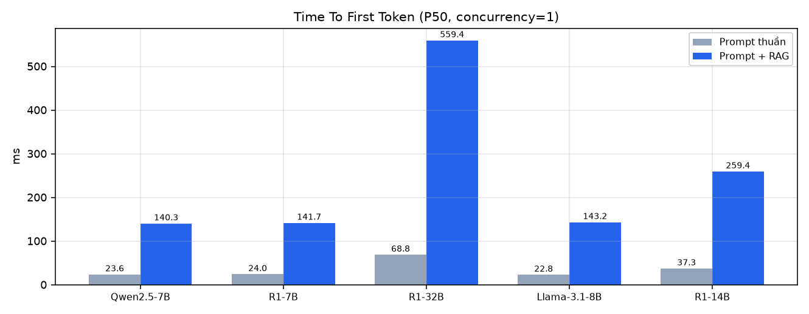
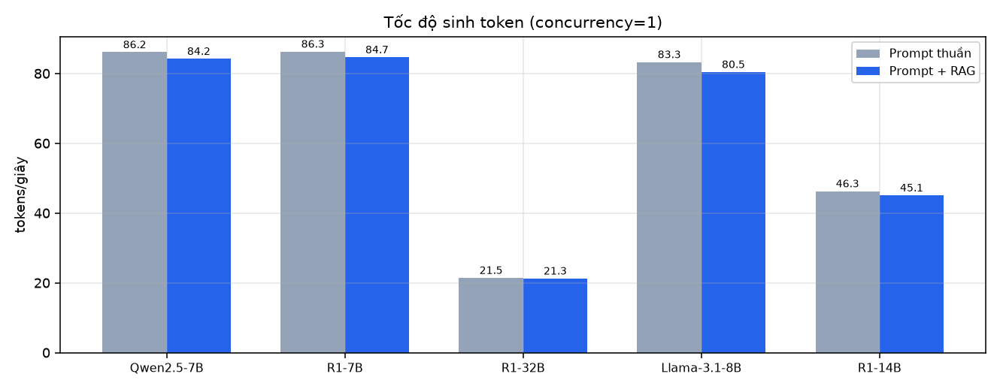
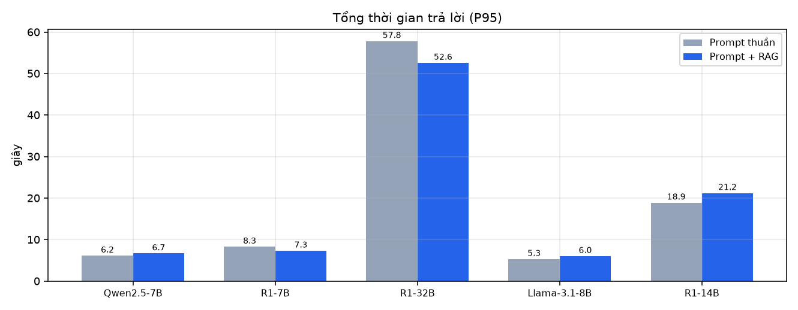
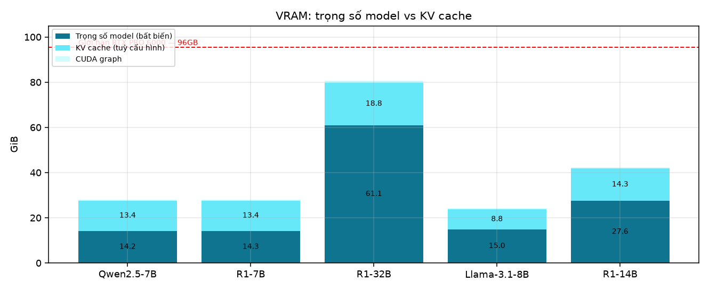

> **Đọc cột VRAM cho đúng.** vLLM cấp phát trước toàn bộ KV cache theo tham số `--gpu-memory-utilization`, nên `nvidia-smi` luôn báo đúng bằng `util × VRAM card` — **bất kể model to hay nhỏ**. Bằng chứng đo được ở chính pod này: Qwen2.5-7B và DeepSeek-R1-Distill-7B có trọng số gần như y hệt (14.25 vs 14.27 GiB, vì cùng 7.6B và cùng nền Qwen), nhưng nếu đặt util lệch nhau thì `nvidia-smi` báo lệch tới 24GB. Vì vậy **chỉ số trả lời đúng câu "model nào ngốn bao nhiêu" là TRỌNG SỐ MODEL**, lấy từ log vLLM. Trong thí nghiệm này hai model 7B được đặt **cùng util 0.35** để loại hẳn biến nhiễu đó.

> **32B chậm là vì nó nghĩ lâu, không phải vì code chậm.** Xem hai dòng *Thinking time* và *Tỉ lệ token nghĩ/tổng*: phần lớn thời gian của model reasoning nằm trong thẻ `<think>`, tức là nháp logic trước khi chốt. TPOT (thời gian mỗi token) giữa các model chênh nhau ít hơn nhiều so với tổng latency — chứng tỏ khác biệt đến từ **số lượng token phải sinh**, không phải tốc độ phục vụ.

---

## Slide 5 — So sánh chất lượng

| Chỉ số | Qwen2.5-7B<br>thuần / RAG | R1-7B<br>thuần / RAG | R1-32B<br>thuần / RAG | Llama-3.1-8B<br>thuần / RAG | R1-14B<br>thuần / RAG |
|---|---:|---:|---:|---:|---:|
| Vấn đề 1 — Ra đề | 48.1% / **63.0%** | 59.3% / **66.7%** | 88.9% / **85.2%** | 59.3% / **40.7%** | 85.2% / **85.2%** |
| Vấn đề 2 — Giải toán *(bộ gốc)* | 94.4% / **94.4%** | 95.6% / **94.4%** | 96.1% / **100.0%** | 71.7% / **78.9%** | 97.2% / **97.2%** |
| **Vấn đề 2 — Giải toán (bộ KHÓ)** | 73.3% / **76.1%** | 76.1% / **76.7%** | 89.4% / **91.7%** | 43.9% / **50.0%** | 85.0% / **86.1%** |
| Vấn đề 3 — Chấm bài | 79.9% / **74.1%** | 75.5% / **68.3%** | 92.1% / **87.0%** | 74.8% / **78.4%** | 86.3% / **80.6%** |
| *bộ gốc* · MAE101 | 98.3% / **95.0%** | 100.0% / **95.0%** | 96.7% / **100.0%** | 70.0% / **86.7%** | 96.7% / **98.3%** |
| *bộ gốc* · MAD101 | 93.3% / **93.3%** | 93.3% / **93.3%** | 95.0% / **100.0%** | 70.0% / **71.7%** | 100.0% / **100.0%** |
| *bộ gốc* · MAS291 | 91.7% / **95.0%** | 93.3% / **95.0%** | 96.7% / **100.0%** | 75.0% / **78.3%** | 95.0% / **93.3%** |
| *bộ gốc* · Dễ | 94.4% / **96.3%** | 98.2% / **94.4%** | 100.0% / **100.0%** | 87.0% / **85.2%** | 98.2% / **100.0%** |
| *bộ gốc* · Trung bình | 97.0% / **94.0%** | 94.0% / **91.0%** | 95.5% / **100.0%** | 73.1% / **82.1%** | 100.0% / **95.5%** |
| *bộ gốc* · Khó | 91.5% / **93.2%** | 94.9% / **98.3%** | 93.2% / **100.0%** | 55.9% / **69.5%** | 93.2% / **96.6%** |
| **bộ KHÓ** · MAE101 | 76.7% / **73.3%** | 81.7% / **78.3%** | 83.3% / **93.3%** | 31.7% / **40.0%** | 85.0% / **86.7%** |
| **bộ KHÓ** · MAD101 | 61.7% / **73.3%** | 71.7% / **73.3%** | 91.7% / **90.0%** | 40.0% / **50.0%** | 88.3% / **86.7%** |
| **bộ KHÓ** · MAS291 | 81.7% / **81.7%** | 75.0% / **78.3%** | 93.3% / **91.7%** | 60.0% / **60.0%** | 81.7% / **85.0%** |
| **bộ KHÓ** · Trung bình | 64.6% / **83.3%** | 83.3% / **87.5%** | 93.8% / **93.8%** | 47.9% / **70.8%** | 87.5% / **93.8%** |
| **bộ KHÓ** · Khó | 76.5% / **73.5%** | 73.5% / **72.7%** | 87.9% / **90.9%** | 42.4% / **42.4%** | 84.1% / **83.3%** |

### Vấn đề 2 chạy trên HAI bộ đề — và đó là phát hiện quan trọng nhất

| Bộ đề | Số câu | Thấp nhất | Cao nhất | **Khoảng phân tách** |
|---|---:|---:|---:|---:|
| Bộ gốc (easy/medium/hard) | 180 | 71.7% | 100.0% | **28.3 điểm** |
| **Bộ khó** (medium 48 / hard 132) | 180 | 43.9% | 91.7% | **47.8 điểm** |

**Bộ khó khôi phục sức phân biệt**: dải rộng ra 47.8 điểm (gấp 1.7× bộ gốc). Đây mới là bộ dùng để kết luận cho bài toán giải toán.

> Bài học phương pháp, đáng đưa lên slide: **một bộ test không phân biệt được các model thì không chứng minh được gì — kể cả khi mọi model đều đạt điểm cao.** Điểm cao trên đề dễ chỉ nói lên đề dễ. Nhóm giữ **cả hai** bộ trong báo cáo chính vì lý do đó: bộ gốc cho thấy *dễ thì model nào cũng làm được*, bộ khó cho thấy *khó mới lộ ra khác biệt thật*.

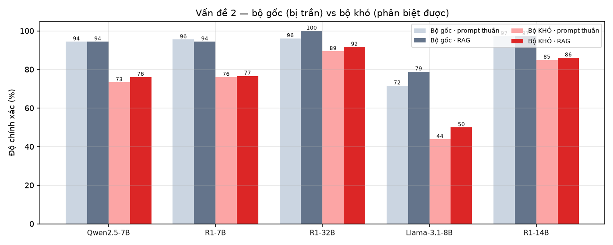

### Bộ ba chỉ số RAG (RAG Triad) — chỉ đo ở chế độ RAG

| Chỉ số | Qwen2.5-7B | R1-7B | R1-32B | Llama-3.1-8B | R1-14B | Ý nghĩa |
|---|---:|---:|---:|---:|---:|---|
| Context Relevance | 93.4% | 94.5% | 96.4% | 96.4% | 96.3% | Truy hồi có lấy đúng định lý/công thức cần không |
| Groundedness | 94.0% | 95.7% | 96.4% | 91.5% | 96.9% | Câu trả lời có dựa vào tài liệu được cấp không |
| Answer Relevance | 94.4% | 94.4% | 100.0% | 78.9% | 97.2% | Đáp án cuối có khớp Ground Truth không |
| Tỉ lệ trích dẫn [n] | 7.8% | 3.3% | 11.7% | 4.4% | 12.8% | Model có nêu nguồn không |
| Có lấy được lý thuyết | 100.0% | 100.0% | 100.0% | 100.0% | 100.0% | Tỉ lệ câu truy hồi ra ≥1 đoạn lý thuyết |

**Context Relevance đo độc lập bằng embedding:** 0.578 (cosine trung bình giữa đoạn truy hồi được và `expected_context` do người ra đề viết). Chỉ số này **không nhờ AI chấm** nên dùng để đối chứng với cột Context Relevance ở trên.

**Kiểm tra trùng lặp dữ liệu:** 0.0% số câu test có bài trong ngân hàng giống ≥ 0.95 (cosine). Nếu tỉ lệ này cao thì RAG 'thắng' một cách tầm thường do chép được đáp án — nên phải công bố cùng kết quả.

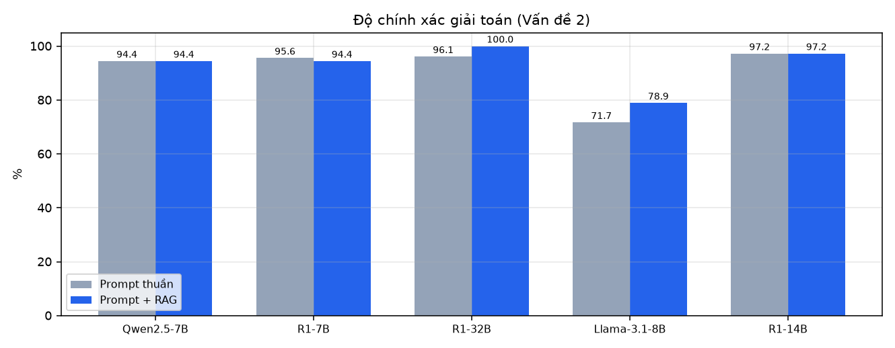
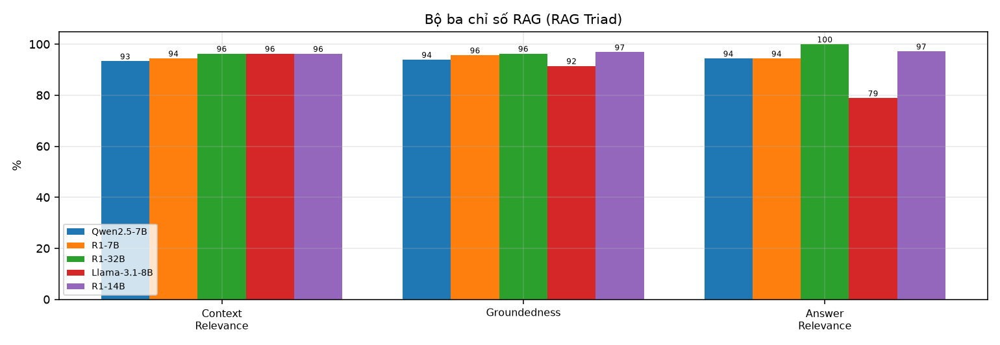

---

## Slide 6 — Prompt thuần vs Prompt + RAG

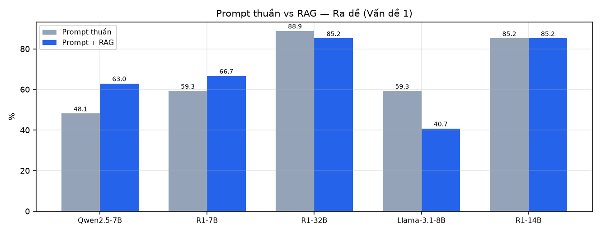

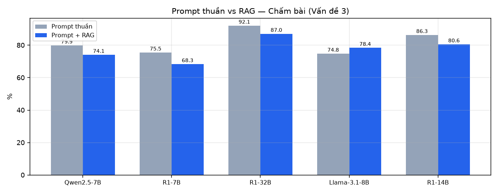

| Model | Ra đề (V1) | Giải toán (V2) | Chấm bài (V3) |
|---|---:|---:|---:|
| Qwen2.5-7B | 48.1% → 63.0% (+14.8 đ%) | 94.4% → 94.4% (+0.0 đ%) | 79.9% → 74.1% (-5.8 đ%) |
| R1-7B | 59.3% → 66.7% (+7.4 đ%) | 95.6% → 94.4% (-1.1 đ%) | 75.5% → 68.3% (-7.2 đ%) |
| R1-32B | 88.9% → 85.2% (-3.7 đ%) | 96.1% → 100.0% (+3.9 đ%) | 92.1% → 87.0% (-5.0 đ%) |
| Llama-3.1-8B | 59.3% → 40.7% (-18.5 đ%) | 71.7% → 78.9% (+7.2 đ%) | 74.8% → 78.4% (+3.6 đ%) |
| R1-14B | 85.2% → 85.2% (+0.0 đ%) | 97.2% → 97.2% (+0.0 đ%) | 86.3% → 80.6% (-5.8 đ%) |

---

## Slide 7 — Phân tích nguyên nhân lỗi

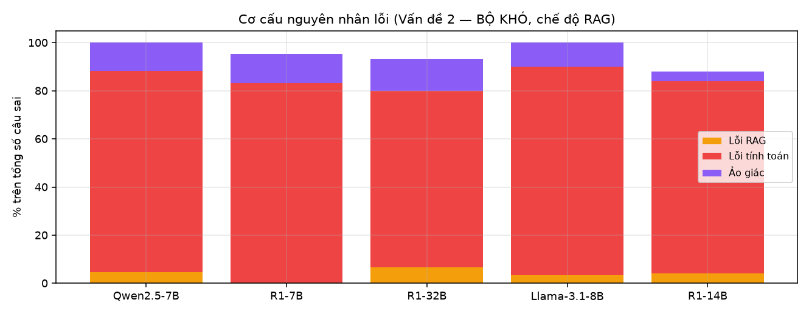

> Bảng dưới tính trên **bộ KHÓ**, chế độ RAG. Lý do: trên bộ gốc R1-32B đạt 100% → **không còn câu sai nào để phân tích**, bảng sẽ hiện 0%/0%/0% và bị đọc nhầm thành *không bao giờ sai*. Mẫu số là **số câu SAI của chính model đó** (ghi ở dòng cuối), nên mỗi cột cộng lại bằng 100%.

| Nguyên nhân | Qwen2.5-7B | R1-7B | R1-32B | Llama-3.1-8B | R1-14B | Định nghĩa |
|---|---:|---:|---:|---:|---:|---|
| Lỗi do RAG (Retrieval) | 4.7% | 0.0% | 6.7% | 3.3% | 4.0% | Sai vì VectorDB trích thiếu/nhầm công thức |
| Lỗi suy luận (Calculation) | 83.7% | 83.3% | 73.3% | 86.7% | 80.0% | Lấy đúng công thức, dùng đúng phương pháp, nhưng tính sai |
| Ảo giác (Hallucination) | 11.6% | 11.9% | 13.3% | 10.0% | 4.0% | Phớt lờ tài liệu, tự bịa công thức/dữ kiện |
| *(số câu SAI — mẫu số của 3 dòng trên)* | 43 | 42 | 15 | 90 | 25 | Càng nhỏ càng tốt |

| Chỉ số phụ | Qwen2.5-7B | R1-7B | R1-32B | Llama-3.1-8B | R1-14B |
|---|---:|---:|---:|---:|---:|
| Timeout rate | 0.0% | 0.0% | 0.0% | 0.0% | 0.0% |
| Truncation rate | 0.2% | 2.1% | 0.8% | 3.0% | 0.2% |
| OOM rate | 0.0% | 0.0% | 0.0% | 0.0% | 0.0% |
| Lỗi gọi API | 0.0% | 0.0% | 0.0% | 0.0% | 0.0% |

> Ví dụ thực tế của từng loại lỗi: xem sheet **Chi tiết từng câu** trong `ket_qua_benchmark.xlsx`, lọc cột *Nguyên nhân lỗi*.

### Lỗi thứ tư không có trong phân loại ban đầu: rò ngôn ngữ

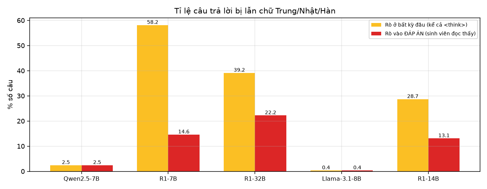

| Chỉ số | Qwen2.5-7B | R1-7B | R1-32B | Llama-3.1-8B | R1-14B |
|---|---:|---:|---:|---:|---:|
| Rò chữ Trung/Nhật/Hàn (bất kỳ đâu) — thuần / RAG | 1.9% / 2.5% | 59.9% / 58.2% | 33.1% / 39.2% | 0.0% / 0.4% | 34.6% / 28.7% |
| **Rò vào ĐÁP ÁN (SV đọc thấy)** — thuần / RAG | 1.9% / 2.5% | 20.3% / 14.6% | 18.2% / 22.2% | 0.0% / 0.4% | 19.8% / 13.1% |
| **Rò vào ĐÁP ÁN — gộp cả hai chế độ** | **2.2%** | **17.5%** | **20.2%** | **0.2%** | **16.4%** |

> Tách theo **cả hai chế độ** vì rò CJK là đặc tính của MODEL, không phụ thuộc RAG. Dòng **gộp** là con số dùng để kết luận (và dùng lại nguyên vẹn ở Slide 12) — tránh việc trích một chế độ rồi trình bày như đặc tính chung.

Phát hiện trong lúc chạy, **không nằm trong thiết kế ban đầu**: dòng DeepSeek-R1-Distill được chưng cất từ dữ liệu đa ngữ nặng tiếng Trung nên chèn chữ Hán vào giữa câu tiếng Việt. Ví dụ có thật lấy từ log:

```
Tuy nhiên, sinh viên đã tính ra 19π cm²/s, có thể他们是 đã tính sai số
                                              ^^^^^^ tiếng Trung
```
Với sản phẩm phục vụ sinh viên Việt Nam thì đây **không phải tiểu tiết học thuật** — sinh viên nhìn thấy ngay. Ta tách hai mức: rò trong thẻ `<think>` (người dùng không thấy, chấp nhận được) và rò vào **đáp án** (nghiêm trọng). Hệ thống production đã phải cài bộ chặn `_has_cjk` trong `features.py` chính vì hiện tượng này.

---

## Slide 8 — Vấn đề 3: chấm bài sinh viên (chi tiết)

Bộ test được sinh có **nhãn biết trước**, nên đây là bài toán phân loại nhị phân đo được chính xác:

| Biến thể bài làm | Nhãn | Nguồn nhãn | Qwen2.5-7B | R1-7B | R1-32B | Llama-3.1-8B | R1-14B |
|---|---|---|---:|---:|---:|---:|---:|
| `correct_verbatim` | Đúng | code | 97.8% | 90.0% | 100.0% | 90.7% | 97.8% |
| `correct_paraphrase` | Đúng | LLM + code kiểm số | 88.5% | 92.3% | 96.2% | 80.8% | 80.8% |
| `arithmetic_slip` | Sai | code | 69.4% | 74.3% | 94.4% | 86.1% | 94.4% |
| `incomplete` | Sai | code | 35.5% | 28.1% | 53.1% | 56.2% | 40.6% |

| Chỉ số (chế độ prompt thuần) | Qwen2.5-7B | R1-7B | R1-32B | Llama-3.1-8B | R1-14B | Vì sao quan trọng |
|---|---:|---:|---:|---:|---:|---|
| **False-Pass Rate** | 22.1% | 33.8% | 14.7% | 30.8% | 20.6% | Cho bài SAI đậu — hỏng tính công bằng của điểm số |
| **False-Fail Rate** | 18.3% | 14.3% | 1.4% | 9.2% | 7.0% | Đánh trượt bài ĐÚNG chỉ vì viết khác — SV khiếu nại, GV mất niềm tin |

### Vì sao 32B được chọn làm giám khảo — chính bảng trên là bằng chứng

Nhiệm vụ của giám khảo ("đối chiếu bài làm với đáp án chuẩn, kết luận đúng/sai") **chính là Vấn đề 3**. Nên bảng ở trên vừa là kết quả nghiệp vụ, vừa là căn cứ chọn giám khảo — không cần thí nghiệm riêng.

`R1-32B` đạt **92.1%** trên tập nhãn khách quan, hơn model kế tiếp **+5.8 điểm** và hơn các model 7–8B khoảng **17 điểm**. Việc chọn nó làm giám khảo vì thế **không phải quyết định tuỳ tiện — nó là model chấm chính xác nhất trong hệ thống, và điều đó được đo chứ không phải giả định**.


### Độ tin cậy của giám khảo AI — đo, không giả định

Giám khảo (32B) được đem chấm **138/139** mẫu mà **nhãn đúng/sai đã biết trước do code sinh ra**. Kết quả phải tách theo loại ca, vì gộp lại sẽ cho một con số gây hiểu sai:

| Loại ca | Độ chính xác giám khảo | Có xảy ra trong V2 không? |
|---|---:|---|
| `arithmetic_slip` | 86.1% | Có |
| `correct_paraphrase` | 96.0% | Có |
| `correct_verbatim` | 100.0% | Có |
| `incomplete` | 12.5% | Không |
| **Gộp các ca bài làm ĐẦY ĐỦ** | **94.3%** (106 mẫu) | **Đây là con số dùng để đánh giá độ tin cậy** |
| Ca bài làm cắt cụt | 12.5% (32 mẫu) | Không |
| *(gộp tất cả — con số gây hiểu sai)* | *75.4%* | — |

**Đọc bảng này cho đúng.** Giám khảo đạt **94.3%** trên các ca bài làm đầy đủ — tức đúng những ca xảy ra khi chấm Vấn đề 2. Nó chỉ yếu ở ca bài làm **cắt cụt** (12.5%): khi lời giải dừng giữa chừng nhưng phần đã viết thì đúng, giám khảo có xu hướng chấm ĐÚNG — nó **dễ dãi với bài dở dang**.

Điểm yếu đó **không ảnh hưởng số liệu Vấn đề 2**, vì tỉ lệ câu trả lời bị cắt gộp toàn bộ 5,260 lượt chỉ **1.3%** (model tệ nhất cũng chỉ 4.6%) — model không bao giờ dừng giữa chừng như biến thể nhân tạo kia. Và kể cả nếu có, độ dễ dãi này áp dụng **như nhau cho mọi model**, nên phép SO SÁNH giữa các model vẫn đứng vững.

> Trả lời trực tiếp câu "lấy gì bảo đảm giám khảo AI chấm đúng?": **không bảo đảm bằng lời — bảo đảm bằng số.** Bộ V3 có nhãn do code sinh nên dùng làm thước đo chính giám khảo được, và điểm yếu tìm thấy đã được định lượng cùng phạm vi ảnh hưởng của nó.

---

## Slide 9 — Chi phí

Tổng token toàn bộ thí nghiệm: **8,518,365** input + **2,844,791** output = **11,363,156** token.

| Phương án | Chi phí cho đúng khối lượng này |
|---|---:|
| API `gpt-4o` | $49.74 |
| API `gpt-4o-mini` | $2.98 |
| API `deepseek-chat` | $5.43 |
| **DeepSeek-R1 tự host (nhóm)** | **$0.00** (token) |

> Tự host không miễn phí tuyệt đối: GPU RTX PRO 6000 trên RunPod ≈ $2.00/giờ. Điểm mấu chốt là chi phí **không tăng theo lượng token** — dùng càng nhiều càng rẻ tương đối, và **dữ liệu bài làm của sinh viên không rời khỏi hạ tầng trường**.

---

## Slide 10 — Kết luận: dùng model nào cho việc gì

| Vấn đề | Cấu hình tốt nhất (theo số đo) | Độ chính xác | Độ trễ P50 |
|---|---|---:|---:|
| **Ra đề** | R1-32B · prompt thuần | 88.9% | 34.7s |
| **Giải toán — bộ khó** | R1-32B · prompt + RAG | 91.7% | 34.7s |
| **Chấm bài** | R1-32B · prompt thuần | 92.1% | 34.7s |
| Chat / Đấu trường (ưu tiên tốc độ) | Qwen2.5-7B | 76.1% (V2-khó) | **3.3s** |

> ⚠️ **Không đủ căn cứ thống kê để tuyên bố người thắng ở Vấn đề 2.** Cấu hình dẫn đầu (R1-32B · prompt + RAG, 91.7%) chỉ hơn cấu hình thứ hai (R1-32B · prompt thuần, 89.4%) **2.2 điểm %**. Với n=180 và mỗi câu chạy 1 lượt, chênh lệch dưới 5 điểm % nằm trong khoảng dao động do lấy mẫu (temperature > 0) — phải chọn theo tiêu chí khác (độ trễ, VRAM, tỉ lệ rò ngôn ngữ).


### Vì sao KHÔNG fine-tune

1. **Không có dữ liệu huấn luyện đủ chuẩn.** Fine-tune cần hàng nghìn cặp (đề → lời giải) đã được giảng viên kiểm duyệt. Ngân hàng câu hỏi hiện có 14,512 bài nhưng chưa qua thẩm định sư phạm từng bài — fine-tune trên dữ liệu chưa sạch sẽ *dạy model học luôn cả lỗi*.
2. **RAG sửa được tức thì, fine-tune thì không.** Giảng viên đổi giáo trình hay sửa một công thức → chỉ cần nạp lại tài liệu, vector cập nhật ngay. Với fine-tune phải huấn luyện lại toàn bộ.
3. **Fine-tune không chữa được lỗi tính toán.** Bảng phân tích lỗi cho thấy phần lớn lỗi là *Calculation*, tức bản chất số học của LLM — thêm dữ liệu cùng miền không sửa được, trong khi RAG + kiểm tra bằng sympy thì có.
4. **Chi phí và rủi ro.** Fine-tune 32B cần nhiều GPU-giờ, dễ *catastrophic forgetting*, và phải đánh giá lại từ đầu sau mỗi lần chạy.
5. **Phạm vi đồ án là ứng dụng, không phải nghiên cứu mô hình.** Mục tiêu là *giải quyết 3 bài toán nghiệp vụ*, và số liệu ở trên cho thấy prompt + RAG đã đạt.

### DeepSeek-R1 có thật sự giải quyết được 3 vấn đề không?

Ngưỡng "đạt" được đặt **trước** khi xem kết quả, theo mức độ rủi ro của từng nghiệp vụ: V1 ≥ 70%, V2 (bộ khó) ≥ 70%, V3 ≥ 85%.

| Vấn đề | Ngưỡng | 32B đạt (tốt nhất) | Kết luận | Vì sao ngưỡng đó |
|---|---:|---:|---|---|
| V1 | 70% | 88.9% | ✅ **ĐẠT** | đề GV còn duyệt lại trước khi dùng nên sai sót còn cứu được |
| V2H | 70% | 91.7% | ✅ **ĐẠT** | sinh viên đối chiếu được với lời giải từng bước; đo trên BỘ KHÓ vì bộ gốc bị trần |
| V3 | 85% | 92.1% | ✅ **ĐẠT** | chấm điểm ảnh hưởng trực tiếp tới quyền lợi SV nên ngưỡng phải cao hơn |

**Trả lời: CÓ.** DeepSeek-R1-Distill-32B vượt ngưỡng ở cả ba bài toán.

### Tại sao không chọn cỡ trung gian (14B)?

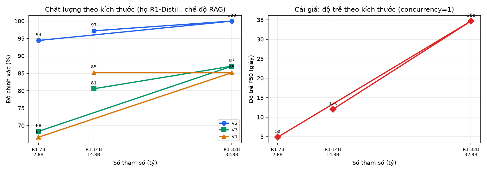

| Model | Tham số | Trọng số | **V2-khó (RAG)** | V3 (RAG) | Độ trễ P50 | Rò chữ Hán vào đáp án *(gộp 2 chế độ)* |
|---|---:|---:|---:|---:|---:|---:|
| R1-7B | 7.6B | 14.27 GiB | 76.7% | 68.3% | 4.9s | 17.5% |
| R1-32B | 32.8B | 61.06 GiB | 91.7% | 87.0% | 34.7s | 20.2% |
| R1-14B | 14.8B | 27.59 GiB | 86.1% | 80.6% | 12.0s | 16.4% |

Chênh lệch 32B − 14B, đo ở **cả hai chế độ** (ngưỡng nhiễu tự đặt: 5 điểm %):

| Nghiệp vụ | 14B | 32B | Chênh | Có vượt ngưỡng nhiễu? |
|---|---:|---:|---:|---|
| V2 bộ KHÓ · prompt thuần | 85.0% | 89.4% | **+4.4** | ❌ không |
| V2 bộ KHÓ · prompt + RAG | 86.1% | 91.7% | **+5.6** | ✅ có |
| V3 chấm bài · prompt thuần | 86.3% | 92.1% | **+5.8** | ✅ có |
| V3 chấm bài · prompt + RAG | 80.6% | 87.0% | **+6.5** | ✅ có |

**Đọc bảng cho trung thực.** Ở **Vấn đề 2 bộ khó**, chênh lệch **vắt ngang ngưỡng**: 4.4 điểm ở chế độ thuần (dưới ngưỡng) nhưng 5.6 điểm ở chế độ RAG (trên ngưỡng). Chỉ trích dẫn con số 5.6 rồi kết luận '32B hơn hẳn' là **chọn đúng chế độ có lợi cho kết luận mình muốn** — nhóm không làm vậy. Riêng Vấn đề 2, số liệu **chưa đủ để tách 14B khỏi 32B**.

**Căn cứ thật sự nằm ở Vấn đề 3 — chấm bài.** Ở đó 32B hơn 14B **5.8 điểm** (thuần) và **6.5 điểm** (RAG) — vượt ngưỡng ở **cả hai** chế độ, nên không phụ thuộc vào việc chọn chế độ nào. Quan trọng hơn: V3 là bộ **có nhãn do code sinh**, chấm bằng so khớp máy móc chứ **không nhờ giám khảo AI** → con số này không thể bị nghi là do giám khảo thiên vị. Và chấm bài chính là nghiệp vụ **rủi ro cao nhất** (ảnh hưởng trực tiếp điểm số sinh viên), nên đây là chỗ đáng trả giá.

**Cái giá của 32B:** chậm hơn 2.9× (34.7s vs 12.0s) và tốn thêm 33.5 GiB trọng số. **Kết luận có điều kiện:** chọn 32B **vì Vấn đề 3**; nếu hệ thống chỉ cần giải toán (Vấn đề 2) thì **14B là lựa chọn hợp lý hơn** — gần bằng chất lượng, nhanh hơn ~3×, nhẹ hơn 33 GiB.

> Chỗ này đáng nói thẳng trước hội đồng: **một phép đo không ủng hộ kết luận thì phải báo cáo đúng như vậy.** Vấn đề 2 không tách được 14B/32B, và nhóm ghi lại điều đó thay vì lờ đi — chính vì thế con số ở Vấn đề 3 mới đáng tin.

> Đây chính là lý do phải đo cả ba cỡ. Nếu chỉ có 7B và 32B thì kết luận "phải dùng 32B" mới là suy diễn từ hai điểm mút — không biết đường cong bão hoà ở đâu, và không trả lời được câu hỏi hiển nhiên của hội đồng.

### Tại sao không dùng model khác?

| Phương án | Vì sao loại | Căn cứ |
|---|---|---|
| **Qwen2.5-7B-Instruct** | Nhanh nhất (3.3s) nhưng kém suy luận | V2-khó 76.1% so với 32B 91.7% |
| **Llama-3.1-8B-Instruct** | Đối chứng khác họ — xác nhận kết luận không phải đặc thù họ Qwen | V2-khó 50.0%; V3 78.4% |
| **DeepSeek-R1-Distill-7B** | Chậm hơn Qwen mà không chính xác hơn, lại rò tiếng Trung nặng | V2-khó 76.7%; rò chữ Hán vào đáp án 17.5% so với Qwen 2.2% (gộp 2 chế độ) |
| **DeepSeek-R1-Distill-14B** | Xem mục đường cong kích thước ngay trên | V2-khó 86.1%; V3 80.6%; độ trễ 12.0s |
| **GPT-4o / API thương mại** | Bài làm và dữ liệu học tập của SV phải rời khỏi hạ tầng trường; chi phí tăng tuyến tính theo token | Xem Slide 9 — Chi phí |
| **32B-AWQ (lượng tử hoá 4-bit)** | **Chưa kiểm chứng** — về lý thuyết ~20GB, đủ chỗ chạy kèm 7B, nhưng nhóm CHƯA đo nên không đưa vào kết luận | — |
| **Fine-tune** | Xem mục ngay trên | — |

> Ghi chú trung thực: dòng 32B-AWQ là **hướng chưa thử**, không phải phương án bị bác bỏ. Nếu cần chạy đồng thời một model nhanh cho Chat/Đấu trường và một model sâu cho Chấm bài trên **một** GPU 96GB thì đó là hướng đáng đo tiếp.

---

## Slide 11 — Model đã chọn: prompt thuần vs RAG theo từng vấn đề

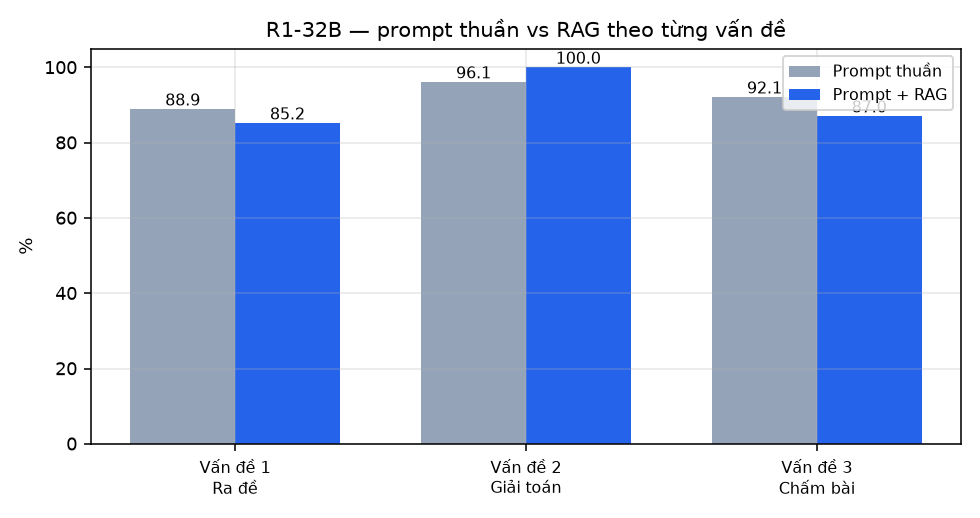

**Độ chính xác được xác định thế nào:**

| Vấn đề | Căn cứ chấm |
|---|---|
| V1 — Ra đề | Không có đáp án chuẩn → rubric 4 tiêu chí (giải được / đúng chủ đề / đáp án tự khai đúng / đề rõ nghĩa) + kiểm chéo bằng cách bắt model mạnh nhất giải lại đề |
| V2 — Giải toán | So với `expected_answer` của bộ 180 câu. Ưu tiên đối chiếu bằng code (chuẩn hoá chuỗi + so tập số); chỉ ca mơ hồ mới nhờ giám khảo LLM chấm **có tham chiếu** |
| V3 — Chấm bài | So phán quyết của model với **nhãn biết trước** do code sinh → không cần AI chấm, con số là khách quan tuyệt đối |

---

## Slide 12 — Từ đo lường đến hành động: các chỉnh sửa rút ra cho hệ thống

> Thí nghiệm này **không dừng ở việc chọn model**. Nó phát hiện 7 vấn đề có thật trong AI service đang chạy — mỗi vấn đề kèm số đo, vị trí trong code và hành động cụ thể. Đây là phần chuyển từ *đo đạc* sang *kỹ thuật*.

| # | Phát hiện | Số đo (bằng chứng) | Hành động | Mức |
|---|---|---|---|---|
| 1 | Bộ chặn chữ Hán `_has_cjk` chỉ áp cho **1/10 hàm** trong `features.py` (chỉ `grade_essay`) | 32B rò chữ Hán vào đáp án **20.2%**; Llama-3.1-8B rò **0.2%** → là đặc tính riêng dòng R1-Distill | Tách guard+retry của `grade_essay` thành helper dùng chung; áp cho `solve`, `generate_questions`, `arena_questions` trước tiên | 🔴 |
| 2 | `TASK_LIMITS.solve_full.think = 3500` **thấp hơn đỉnh nhu cầu** | Token `<think>` khi giải đề khó (n=360): p95 **1.489** · p99 **2.504** · max **4.691** → **1/360 câu (0,3%)** vượt 3.500. Hiếm, nhưng hỏng thì hỏng hẳn: hết ngân sách think thì JSON **không bao giờ được in** | Nâng `solve_full` → **5.500** (ngân sách thừa không tốn gì nếu không dùng tới); `concept_lookup` 1.500 → 2.500; `arena_generation` 2.000 → 2.500 | 🟡 |
| 3 | **RAG làm hỏng tác vụ đối chiếu** | Chấm bài 32B: 92.1% → **87.0%** khi bật RAG; False-Pass 14.7% → **25.0%**. Đúng ở **4/5 model**; ngoại lệ: Llama-3.1-8B | `grade_essay` đã KHÔNG dùng RAG → **giữ nguyên**. `explain_mistake` có dùng → **cần đo riêng** trước khi tắt | 🟡 |
| 4 | Bóc đáp án cuối không chịu được `\boxed{}` / markdown | Luật "lấy dòng sau marker" hỏng **128/180** câu với R1-7B, chỉ 2/180 với Qwen → **sai lệch hẳn về một họ model** | Dùng `extract_final()` trong `harness/bench/tasks.py`: ưu tiên `\boxed{}` (đếm ngoặc lồng) rồi tới dòng đầu có nội dung. Đã kiểm: 128 → **0** | 🟡 |
| 5 | Tài liệu MAD101 **bị trùng** trong `document_chunks` | 405 chunk cũ chưa xoá khi nạp bản mới ("Đồ thị" và "Đồ Thị", "Logic" và "Logic mệnh đề & vị từ"...) → top-3 có thể trả 2 đoạn gần trùng | Xoá 8 tài liệu cũ (tên Title Case) | 🟢 |
| 6 | Lý thuyết **lệch giữa các môn** | MAS291 chỉ 198 chunk so với MAD101 1,427 — kém **7 lần** | Bổ sung tài liệu MAS291 — đòn bẩy lớn hơn đổi model | 🟢 |
| 7 | **32B quá chậm cho Chat / Đấu trường** | Độ trễ P50: 32B **34.7s** vs Qwen2.5-7B **3.3s** (chậm 10.4×) | 96GB không chở nổi 32B + model nhanh (32B chiếm 87.3GB, còn 6.1GB < 14.25GB). Hướng **chưa kiểm chứng**: 32B-AWQ ~20GB | 🟢 |

### Ba bài học phương pháp (giá trị hơn cả bảng trên)

1. **Một bộ test không phân biệt được các model thì không chứng minh được gì — kể cả khi mọi model đều điểm cao.** Bộ đề gốc cho mọi model ~94–100%: chọn "người thắng" ở đó là chọn nhiễu. Phải có bộ khó mới lộ ra khác biệt thật.
2. **RAG không phải luôn tốt.** Đo được ở 4/5 model (ngoại lệ Llama-3.1-8B — model duy nhất ngoài họ Qwen, và cũng là model yếu nhất nên còn nhiều chỗ cải thiện). Nó giúp khi model THIẾU kiến thức (ra đề, giải toán khó, tra khái niệm), nhưng gây hại khi nhiệm vụ là ĐỐI CHIẾU hai thứ đã có sẵn trong prompt. Nếu mặc định "bật RAG cho mọi thứ", nhóm đã đưa vào sản phẩm đúng cấu hình làm hỏng tính năng chấm điểm.
3. **Đo cả hai chế độ cho mọi tính năng, đừng giả định.** Phát hiện số 3 hoàn toàn nằm ngoài dự đoán ban đầu — nó chỉ lộ ra vì thí nghiệm chạy cả `prompt thuần` lẫn `prompt + RAG` cho cả ba vấn đề, thay vì chỉ chạy cấu hình được cho là tốt hơn.

> Chi tiết đầy đủ kèm vị trí code: xem `CAN_SUA_AI_SERVICE.md` cùng thư mục.

---

## Hạn chế của nghiên cứu

- **Giám khảo là chính model 32B** (mạnh nhất trong hệ local, không có API ngoài). Giảm thiểu bằng: chấm *có tham chiếu* (đưa sẵn đáp án chuẩn, chỉ đối chiếu chứ không đánh giá cảm tính) + ưu tiên đối chiếu bằng code + **đo độ chính xác của giám khảo trên tập nhãn thật** (kết quả: **94.3%** trên các ca bài làm đầy đủ — đúng loại ca xảy ra khi chấm Vấn đề 2; con số gộp 75.4% bị kéo xuống bởi ca cắt cụt vốn không xuất hiện trong V2 — xem Slide 8).
- **Mỗi câu chạy 1 lượt**, chưa lặp nhiều lần để ước lượng phương sai do sampling (temperature > 0). Với 180 câu/model thì sai số trung bình đã đủ nhỏ cho kết luận so sánh, nhưng chênh lệch < 5 điểm % giữa hai model **không nên coi là có ý nghĩa**.
- **Biến thể `correct_paraphrase`** do LLM sinh, chỉ giữ lại bản qua được kiểm tra bằng code (mọi token số bảo toàn). Các câu có đáp án thuần chữ không sinh được biến thể này.
- **Lý thuyết phân bố lệch giữa các môn** (xem Slide 0) → điểm RAG của môn ít tài liệu bị thiệt; đây là hạn chế của kho học liệu, không phải của model.
