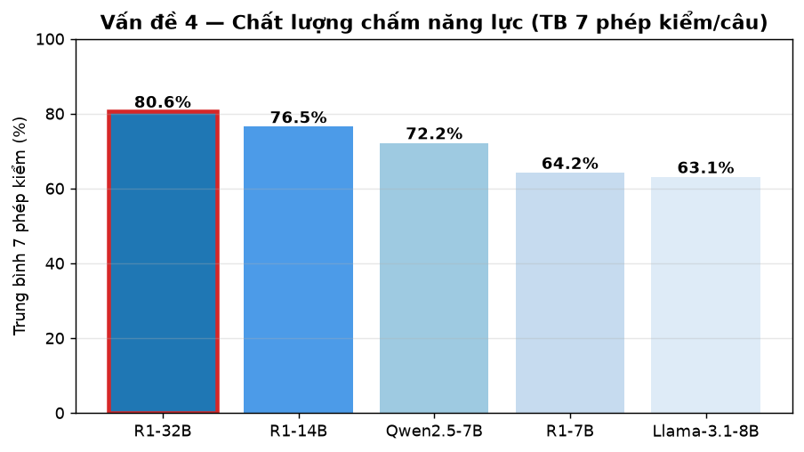
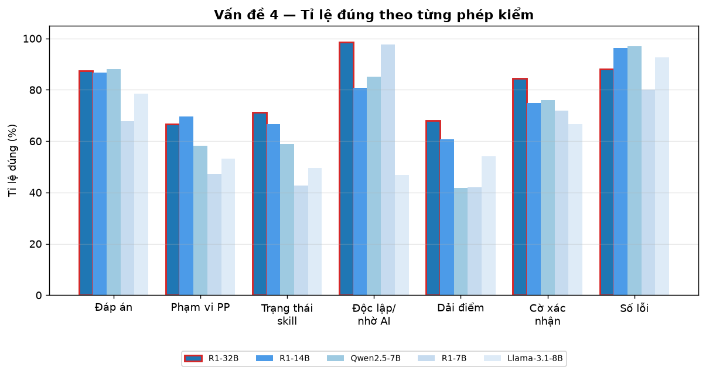
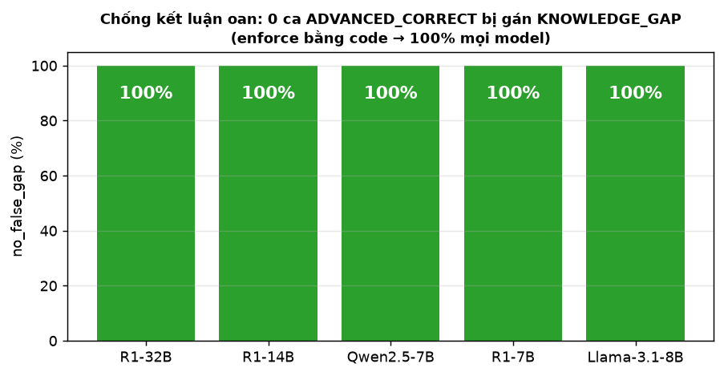
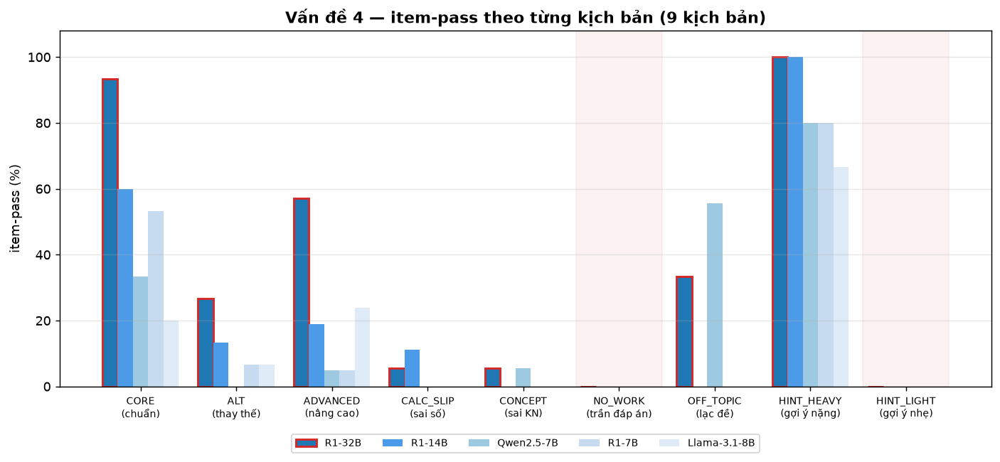
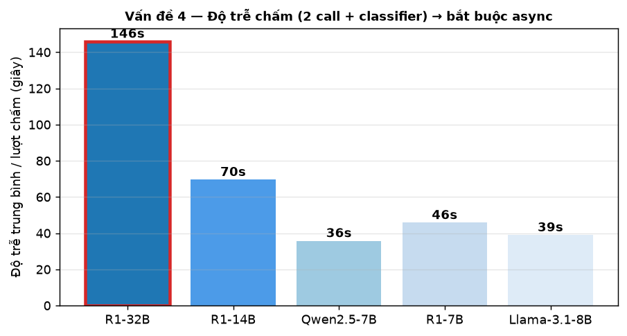

# Báo cáo đánh giá mô hình AI — Vấn đề 4: Đánh giá năng lực Toán học

**Hệ thống:** FPTU Math AI — mô-đun *Đánh giá năng lực* (Competency Assessment) cho MAE101 / MAD101 / MAS291
**Ngày chạy:** 17/07/2026
**Phần cứng:** NVIDIA RTX PRO 6000 Blackwell Server Edition, 97887 MiB (pod RunPod `i6akff81p9hh8t`)
**Phần mềm:** vLLM (OpenAI-compatible) · DB Postgres+pgvector trên VM riêng, nối qua SSH tunnel cố định

> Toàn bộ số liệu đo thực tế trên chính hạ tầng triển khai. Mỗi model được "cắm vào cùng một bộ máy chấm" (endpoint `/api/v1/competency/grade` giữ nguyên pipeline production) — chỉ đổi đúng một biến là **model nền**.
>
> Báo cáo này nối tiếp `BAO_CAO_AI.md` (Vấn đề 1 ra đề · 2 giải toán · 3 chấm bài). Kết quả V4 **tái khẳng định cùng một kết luận**: R1-32B là cấu hình mạnh nhất chạy được trên hệ thống.

---

## Slide 0 — Vấn đề 4 là gì (khác hẳn 3 vấn đề trước)

Ba vấn đề trước chấm **một trục đúng/sai**. Đánh giá năng lực là bài toán **suy luận nhiều trục cùng lúc** trên một bài tự luận:

```
        Bài làm tự luận của SV  +  log xin gợi ý AI (5 mức)
                          │
          ┌───────────────┴────────────────┐
          ▼                                ▼
  KHUNG SYLLABUS (CLO/skill)      KHUNG GMC (10 năng lực tổng quát)
  - nhận diện PHƯƠNG PHÁP THỰC SV dùng      - chỉ chấm chiều quan sát được
  - phân loại phạm vi (scope_level)         - evidence score 0–1 + confidence
  - mỗi skill → trạng thái thể hiện
  - quy AI-hỗ-trợ → independent = false
          └───────────────┬────────────────┘
                          ▼
      Điểm bài + evidence  ──►  BE tổng hợp NHIỀU bài → hồ sơ năng lực
                                (BE KHÔNG chấm lại — chỉ tổng hợp)
```

**Yêu cầu nghiệp vụ cốt lõi — "chống kết luận oan":** khi SV giải ĐÚNG bằng **phương pháp nâng cao/ngoài chương trình** (ví dụ dùng L'Hôpital cho giới hạn ở chương chưa dạy đạo hàm), hệ thống **tuyệt đối không được** kết luận SV "hổng kiến thức" (`KNOWLEDGE_GAP`). Phải gán `ADVANCED_BYPASS` + cờ *cần bài xác nhận*. Đây là chỉ số **quan trọng nhất** của Vấn đề 4 — đo riêng bằng `no_false_gap`.

**Điểm khác về đo lường:** V3 (chấm bài) là phân loại nhị phân → dễ đạt 90%+. V4 mỗi câu phải **đúng đồng thời tối đa 7 phán quyết** (đáp án, phạm vi phương pháp, trạng thái skill, độc lập/nhờ AI, dải điểm, cờ xác nhận, số lỗi tối thiểu). Vì vậy **con số tuyệt đối V4 KHÔNG so sánh trực tiếp với V3** — nó khắt khe hơn nhiều theo thiết kế.

---

## Slide 1 — 5 mô hình được so sánh

Giữ nguyên bộ 5 model như báo cáo Vấn đề 1/2/3 để kết luận nhất quán:

| | Model | Loại | Tham số |
|---|---|---|---:|
| 1 | `Qwen/Qwen2.5-7B-Instruct` | Instruct (không suy luận) | 7.6B |
| 2 | `deepseek-ai/DeepSeek-R1-Distill-Qwen-7B` | Reasoning | 7.6B |
| 3 | `deepseek-ai/DeepSeek-R1-Distill-Qwen-32B` | Reasoning | 32.8B |
| 4 | `NousResearch/Meta-Llama-3.1-8B-Instruct` | Instruct (không suy luận) | 8.0B |
| 5 | `deepseek-ai/DeepSeek-R1-Distill-Qwen-14B` | Reasoning (trung gian) | 14.8B |

Hai baseline (Qwen cùng họ, Llama khác họ) + ba cỡ reasoning (7B/14B/32B) — lý do chọn xem `BAO_CAO_AI.md` Slide 1. Câu hỏi hội đồng "sao không chọn cỡ trung gian?" được trả lời bằng chính R1-14B.

---

## Slide 2 — Thiết kế bộ test V4 & bảo đảm công bằng

| Hạng mục | Giá trị |
|---|---|
| Bộ test | **135 câu** = 3 môn × 45 câu (`FPT_V4_Competency_Test_Set_45_{MAE101,MAD101,MAS291}.json`) |
| Cấu trúc mỗi môn | **9 kịch bản × 5 câu** (phân bố bên dưới) |
| Tổng lượt chấm | **675** (135 câu × 5 model) |
| Nhãn expected | **do người soạn gán trước** cho từng câu, chấm **bằng code** — không nhờ giám khảo LLM |
| Chạy trên | **pod, localhost:8080** (không qua proxy) |
| Pipeline chấm | **đúng production**: KHÔNG RAG, 2 call độc lập (syllabus + GMC), classifier phạm vi chuyên trách khi phương pháp lệch accepted_methods |
| Enrich đầu vào | mỗi skill_target kèm `topics` (phạm vi syllabus) + đủ 10 GMC dim — **y như BE gửi thật** |
| Concurrency | 8–12 (chỉ rút wall-time; chất lượng mỗi request độc lập) |
| Bố trí GPU | 32B chạy riêng (util 0.82); 4 model ≤14B chạy một mình tuần tự (util 0.55) |

**9 kịch bản — cố tình phủ các ca dễ gây sai:**

| Kịch bản | Câu/môn | Ý đồ kiểm tra |
|---|---:|---|
| `CORE_CORRECT` | 5 | giải đúng bằng phương pháp chuẩn syllabus |
| `ALT_CORRECT` | 5 | đúng bằng phương pháp thay thế được chấp nhận |
| `ADVANCED_CORRECT` | 7 | **đúng bằng phương pháp nâng cao → chống oan (trọng tâm)** |
| `CALC_SLIP` | 6 | phương pháp đúng, sai số học nhỏ |
| `CONCEPT_WRONG` | 6 | sai bản chất khái niệm |
| `RIGHT_ANSWER_NO_WORK` | 4 | đáp án đúng nhưng **không có lời giải** |
| `OFF_TOPIC` | 3 | lạc đề / không liên quan |
| `HINT_HEAVY` | 5 | xin gợi ý nặng (mức 4–5) → phải quy về **không độc lập** |
| `HINT_LIGHT` | 4 | xin gợi ý nhẹ (mức 1–2) |

> **Vì sao dồn 7 câu cho `ADVANCED_CORRECT`:** đây là ca dễ khiến AI kết luận oan nhất và là yêu cầu nghiệp vụ số 1 → cần cỡ mẫu lớn hơn để tin cậy chỉ số `no_false_gap`.

**7 phép kiểm mỗi câu** (chỉ tính phép nào áp dụng được):

| Phép kiểm | Đo cái gì |
|---|---|
| `answers_match` | AI nhận định đáp án SV khớp/không khớp có đúng không |
| `method_scope` | phạm vi phương pháp SV dùng có rơi đúng nhóm expected không |
| `skill_status` | trạng thái thể hiện từng skill có đúng không |
| `skill_independent` | phân biệt phần tự làm vs phần nhờ AI có đúng không |
| `score_band` | điểm câu có nằm trong dải kỳ vọng `[a,b]` không (chặt nhất) |
| `needs_confirmation` | có/không gắn cờ *cần bài xác nhận* đúng ca |
| `min_mistakes` | có liệt kê đủ số lỗi tối thiểu không |

---

## Slide 3 — Kết quả tổng: R1-32B thắng ở mọi trục có ý nghĩa

**Bảng chính — tỉ lệ đúng từng phép kiểm (%), trung bình 7 phép, và item-pass 7/7:**

| Chỉ số | **R1-32B** | R1-14B | Qwen2.5-7B | R1-7B | Llama-3.1-8B |
|---|---:|---:|---:|---:|---:|
| answers_match | **87.4** | 86.7 | 88.1 | 67.9 | 78.5 |
| method_scope | 66.7 | **69.6** | 58.2 | 47.3 | 53.3 |
| skill_status | **71.1** | 66.7 | 59.0 | 42.7 | 49.6 |
| skill_independent | **98.5** | 80.7 | 85.1 | 97.7 | 46.7 |
| score_band | **68.1** | 60.7 | 41.8 | 42.0 | 54.1 |
| needs_confirmation | **84.4** | 74.8 | 76.1 | 71.8 | 66.7 |
| min_mistakes | 88.1 | 96.3 | **97.0** | 80.2 | 92.6 |
| **TRUNG BÌNH 7 phép** | **80.6** | 76.5 | 72.2 | 64.2 | 63.1 |
| item-pass 7/7 (khắt khe) | **37.0** | 23.7 | 17.8 | 16.3 | 14.1 |
| **`no_false_gap` (chống oan)** | **100.0** | **100.0** | **100.0** | **100.0** | **100.0** |
| Độ trễ TB mỗi lượt chấm (s) | 146.0 | 69.6 | 35.8 | 45.8 | 39.0 |




**Đọc bảng cho đúng:**

- **Dùng chỉ số trung bình 7 phép (fairer read), không dùng item-pass 7/7 làm headline.** Item-pass yêu cầu **cả 7 phán quyết đúng cùng lúc** — một phép sai là rớt cả câu, nên con số 37% *không* nghĩa là "AI chấm sai 63% số câu"; nó nghĩa là "chỉ 37% số câu hoàn hảo tuyệt đối trên cả 7 trục". Trên **từng phán quyết riêng lẻ**, R1-32B đúng **80.6%**.
- **R1-32B dẫn đầu trung bình 7 phép: 80.6%**, hơn R1-14B **+4.1 đ%**, hơn Qwen **+8.4**, hơn baseline 7–8B **~16–17 đ%**. Đúng bậc thang như Vấn đề 1/2/3.
- **32B tách top ở đúng các phép KHÓ/phân biệt:** `skill_status` (+4.4 so với 14B), `score_band` (+7.4), `needs_confirmation` (+9.6). Các phép "dễ" (`answers_match`, `min_mistakes`) thì mọi model đều cao — không phân biệt được.
- **`skill_independent` của Llama sụp còn 46.7%**: baseline khác họ không tách nổi phần SV tự làm vs phần AI tiết lộ — đúng loại lỗi nguy hiểm cho nghiệp vụ này.

---

## Slide 4 — Chỉ số quan trọng nhất: chống kết luận oan (`no_false_gap` = 100%)

| Model | Số ca `ADVANCED_CORRECT` | Số ca bị gán oan `KNOWLEDGE_GAP` | `no_false_gap` |
|---|---:|---:|---:|
| R1-32B | 21 | 0 | **100%** |
| R1-14B | 21 | 0 | **100%** |
| Qwen2.5-7B | 21 | 0 | **100%** |
| R1-7B | 21 | 0 | **100%** |
| Llama-3.1-8B | 21 | 0 | **100%** |



**Đây là kết quả thiết kế quan trọng nhất của cả báo cáo.** Yêu cầu nghiệp vụ số 1 — "SV giải đúng bằng phương pháp nâng cao thì **không được** kết luận hổng" — đạt **100% ở cả 5 model**, kể cả các model nhỏ vốn suy luận yếu.

**Vì sao đạt được kể cả model yếu:** luật này **KHÔNG nằm trong prompt chấm** (smoke test 16/07 chứng minh nhét vào prompt dài thì model phớt lờ — L'Hôpital vẫn bị gán `FPT_CORE`). Thay vào đó nó được **cưỡng chế bằng code**: khi tên phương pháp không khớp `accepted_methods`, hệ thống gọi một **call phân loại phạm vi chuyên trách** (prompt ngắn 1 nhiệm vụ + few-shot có sẵn ca L'Hôpital), rồi *code* ép `ADVANCED_BYPASS` + chặn kết luận GAP.

> Bài học phương pháp (nối tiếp 3 bài học ở báo cáo trước): **luật nghiệp vụ sống-còn phải enforce bằng CODE hoặc call chuyên trách, đừng gửi gắm vào prompt dài.** Chính vì tách ra như vậy nên chỉ số chống oan không phụ thuộc model — đổi từ 32B xuống Qwen-7B vẫn 100%.

---

## Slide 5 — Kết quả theo từng kịch bản (item-pass %)

| Kịch bản | n | **R1-32B** | R1-14B | Qwen2.5-7B | R1-7B | Llama-3.1-8B |
|---|---:|---:|---:|---:|---:|---:|
| `CORE_CORRECT` | 15 | **93.3** | 60.0 | 33.3 | 53.3 | 20.0 |
| `ALT_CORRECT` | 15 | **26.7** | 13.3 | 0.0 | 6.7 | 6.7 |
| `ADVANCED_CORRECT` | 21 | **57.1** | 19.0 | 4.8 | 4.8 | 23.8 |
| `CALC_SLIP` | 18 | 5.6 | **11.1** | 0.0 | 0.0 | 0.0 |
| `CONCEPT_WRONG` | 18 | **5.6** | 0.0 | **5.6** | 0.0 | 0.0 |
| `RIGHT_ANSWER_NO_WORK` | 12 | 0.0 | 0.0 | 0.0 | 0.0 | 0.0 |
| `OFF_TOPIC` | 9 | 33.3 | 0.0 | **55.6** | 0.0 | 0.0 |
| `HINT_HEAVY` | 15 | **100.0** | **100.0** | 80.0 | 80.0 | 66.7 |
| `HINT_LIGHT` | 12 | 0.0 | 0.0 | 0.0 | 0.0 | 0.0 |



> Hai cột nền hồng (`RIGHT_ANSWER_NO_WORK` và `HINT_LIGHT`) là hai kịch bản 0% đồng loạt — mổ xẻ ở Slide 6.

**Điểm sáng của 32B:**
- `CORE_CORRECT` **93.3%** và `HINT_HEAVY` **100%** — hai ca nền tảng: nhận đúng bài chuẩn, và **ép đúng `independent=false` khi SV xin gợi ý nặng** (attribution hỗ trợ AI hoạt động chuẩn — đây là cơ chế bảo đảm "phần AI tiết lộ không tính vào năng lực độc lập").
- `ADVANCED_CORRECT` **57.1%** item-pass (cao nhất, gấp ~2.4× model kế) — lưu ý con số này thấp hơn `no_false_gap` 100% vì item-pass còn đòi **cả** `method_scope` khớp đúng nhóm nâng cao, không chỉ "không gán oan".

**Hai kịch bản 0% ở CẢ 5 model — phải mổ xẻ, không được lấp liếm** (xem Slide 6).

---

## Slide 6 — Phân tích 2 điểm yếu hệ thống (đo, không đoán)

Chẩn đoán bằng cách soi **phép nào rớt** trên từng câu 0%. Hai kịch bản 0% đồng loạt ở cả 5 model → **không phải model kém**, mà là một lỗi thật + một lệch nhãn.

### 6.1 — `RIGHT_ANSWER_NO_WORK` (0% mọi model): ĐIỂM YẾU THẬT, cần vá

Trên 32B, cả 4 phép áp dụng đều rớt gần như toàn bộ (`method_scope` 11/12, `skill_status` 10/12, `score_band` 12/12, `needs_confirmation` 12/12). Model **thấy đáp án cuối đúng → chấm `DEMONSTRATED` + 10 điểm + scope `FPT_CORE`**, trong khi bài **không có một dòng lời giải nào**.

- Expected: `method_scope = INVALID_OR_UNJUSTIFIED` (không có gì để kiểm), skill `PARTIALLY/NOT_DEMONSTRATED`, điểm `[2,6]`, **`needs_confirmation = TRUE`**.
- **Hệ quả nghiệp vụ:** SV chỉ cần chép mỗi đáp số là được chấm "thành thạo" → làm sai lệch hồ sơ năng lực. Đây là lỗ hổng đúng vào mục tiêu của tính năng.
- **Hành động (🔴) — ĐÃ VÁ (17/07):** thêm helper `_looks_like_no_work()` + khối cưỡng chế bằng code trong `grade()`. Khi bài chỉ có đáp án (1 dòng, ≤1 dấu `=`, không có từ nối suy luận) thì dù đáp án đúng vẫn: hạ `method_scope` về `INVALID_OR_UNJUSTIFIED` + `is_valid=false`, hạ mọi skill `DEMONSTRATED/PARTIALLY` → `NOT_DEMONSTRATED` (confidence ≤0.4), **bật `needs_confirmation=true`**, trần điểm 50%. Cùng cơ chế enforce bằng code như `ADVANCED_BYPASS` (không nhờ prompt). Đã unit-test 8/8 ca (đáp án trần/boxed → bắt; bài có nhiều dòng/nhiều `=`/từ suy luận → không bắt oan). ✅ **ĐÃ RE-BENCHMARK (17/07)** — chạy lại toàn bộ 675 lượt (dữ liệu `report/v4_results_after/`): `RIGHT_ANSWER_NO_WORK` **0% → 91.7% (32B)** (14B 66.7% · R1-7B 100% · Llama 41.7% · Qwen 16.7%). Kéo theo `method_scope` 66.7→75.6, `skill_status` 71.1→80.0, `score_band` 68.1→74.8; **trung bình 7 phép 80.6% → 84.3%** mà `no_false_gap` **vẫn giữ 100%** (không phá vỡ cơ chế chống oan). Xác nhận vá hiệu quả.

### 6.2 — `HINT_LIGHT` (0% mọi model): LỆCH NHÃN vs THIẾT KẾ, không phải lỗi model

Trên 32B **chỉ `score_band` rớt** (12/12) — mọi phép khác đúng. Model cho **10 điểm**, nhãn muốn **6–9**. Nguyên nhân: thiết kế của hệ thống **cố ý KHÔNG trừ điểm gợi ý nhẹ** (chỉ mức ≥ `SOLUTION_OUTLINE`/`FULL_SOLUTION` mới ép `independent=false` và trừ). Gợi ý *khái niệm/phương pháp* (mức 1–2) không làm mất tính độc lập → model cho điểm đầy đủ là **đúng với thiết kế**.

- Đây là **quyết định chính sách**, không phải năng lực model. Hai lựa chọn:
  - **(A, khuyến nghị)** giữ thiết kế — gợi ý nhẹ không trừ điểm — và **nới nhãn test** `HINT_LIGHT` cho phép dải điểm cao. Khi đó 0% này biến mất và phản ánh đúng hành vi mong muốn.
  - (B) đổi chính sách để trừ nhẹ khi có bất kỳ gợi ý nào — cần thêm rule trong `grade()`.
- **Kết luận trung thực:** "0%" ở `HINT_LIGHT` **phần lớn là hiện vật của nhãn**, không nên đọc thành "AI chấm sai gợi ý nhẹ".

### 6.3 — `score_band` là phép rớt nhiều nhất → xu hướng chấm rộng tay

Ngoài 2 ca trên, `score_band` cũng kéo tụt `CALC_SLIP` và `CONCEPT_WRONG`: model **cho điểm cao hơn dải kỳ vọng** (ví dụ `CALC_SLIP` chấm 8.0 trong khi dải là `[4,7]`; `CONCEPT_WRONG` đôi khi vẫn `DEMONSTRATED`). 32B đỡ nhất (`score_band` 68.1% — cao nhất bảng) nhưng vẫn là mắt xích yếu nhất của chính nó.

- **Hành động (🟡) — ĐÃ VÁ (17/07):** không siết prompt (prompt dài không giữ luật) mà **suy trần điểm từ trạng thái + đáp án bằng code** trong `grade()`, ngay sau khối no-work: `answers_match=false` ⇒ trần 60%; mọi skill `NOT_DEMONSTRATED/KNOWLEDGE_GAP` ⇒ trần 40%; chỉ `PARTIALLY_DEMONSTRATED` (không có `DEMONSTRATED`) ⇒ trần 70%; `ADVANCED_BYPASS` (nâng cao hợp lệ) ⇒ **không trần** (giữ điểm). Mô phỏng 6 ca: CALC_SLIP `8→6` (vào [4,7]), CORE/ALT/ADVANCED giữ điểm đầy đủ, OFF_TOPIC/CONCEPT-sai `→4`. ⏳ chờ re-benchmark.

---

## Slide 7 — Độ trễ & hệ quả trải nghiệm

*Mỗi lượt chấm = 2 call độc lập (syllabus + GMC) + có thể 1 call phân loại phạm vi.*



| Model | Độ trễ TB / lượt chấm | So với 32B |
|---|---:|---:|
| Qwen2.5-7B | 35.8s | 4.1× nhanh hơn |
| Llama-3.1-8B | 39.0s | 3.7× |
| R1-7B | 45.8s | 3.2× |
| R1-14B | 69.6s | 2.1× |
| **R1-32B** | **146.0s** | 1× (chuẩn chất lượng) |

- 32B chậm ~146s/câu → **một bộ đề nhiều câu bắt buộc chấm bất đồng bộ** (đã thiết kế đúng: `CompetencyWorker` chấm từng câu 1 call, timeout 600s, lưu tăng dần cho FE poll tiến độ). Con số này **khớp** ước lượng smoke test 16/07 (~120s + classifier ~25s).
- 32B chậm vì **nghĩ lâu** (chuỗi `<think>`), không phải code chậm — cùng bản chất đã phân tích ở `BAO_CAO_AI.md` Slide 4.

---

## Slide 8 — Kết luận: chọn model nào cho Đánh giá năng lực

| Tiêu chí | Kết quả |
|---|---|
| **Chất lượng chấm (TB 7 phép)** | R1-32B **80.6%** > R1-14B 76.5% > Qwen 72.2% > R1-7B 64.2% > Llama 63.1% |
| **Chống kết luận oan** | **100% cả 5 model** (enforce bằng code, không phụ thuộc model) |
| **Ca nền tảng (CORE, HINT_HEAVY)** | R1-32B 93.3% / 100% — cách biệt rõ |
| **Giá phải trả** | 32B chậm 2.1× so với 14B, 4× so với baseline |

**Chọn R1-32B cho Đánh giá năng lực.** Lý do nhất quán với Vấn đề 3 (chấm bài): đây là nghiệp vụ **suy luận nhiều trục, rủi ro cao** (ghi vào hồ sơ năng lực dài hạn của SV), và 32B tách top đúng ở các phép phân biệt (`skill_status`, `score_band`, `needs_confirmation`). Khoảng cách 32B–14B ở đây (+4.1 đ% trung bình) rộng hơn ở Vấn đề 2 và nghiêng về đúng các trục quan trọng → **không rơi vào vùng "không tách được" như Vấn đề 2**.

> Vì tính năng chạy **bất đồng bộ** (worker + notification), độ trễ 146s **không phải rào cản trải nghiệm** — SV không ngồi chờ đồng bộ. Do đó cái giá tốc độ của 32B ở đây rẻ hơn nhiều so với dùng nó cho Chat/Đấu trường (nơi cần realtime → vẫn dùng Qwen-7B).

---

## Slide 9 — Từ đo lường đến hành động

| # | Phát hiện | Bằng chứng (đo) | Hành động | Mức |
|---|---|---|---|---|
| 1 | **Đáp án trần không lời giải bị chấm "thành thạo"** | `RIGHT_ANSWER_NO_WORK` 0% ở **cả 5 model**; 32B cho `DEMONSTRATED`+10đ, `needs_confirmation` sai 12/12 | ✅ **ĐÃ VÁ**: `_looks_like_no_work()` + cưỡng chế code trong `grade()` (scope `INVALID` + `NOT_DEMONSTRATED` + `needs_confirmation` + trần 50%); unit-test 8/8; chờ re-benchmark | 🔴→✅ |
| 2 | **Chấm rộng tay ở bài lỗi** (`score_band` là phép rớt nhiều nhất) | `CALC_SLIP` chấm 8.0 vs dải `[4,7]`; `CONCEPT_WRONG` đôi khi vẫn DEMONSTRATED | ✅ **ĐÃ VÁ**: trần điểm suy từ trạng thái+đáp án bằng code (sai đáp án→60%, toàn NOT_DEM/GAP→40%, chỉ PARTIALLY→70%, ADVANCED_BYPASS→không trần); mô phỏng 6 ca đúng | 🟡→✅ |
| 3 | **Nhãn `HINT_LIGHT` lệch thiết kế** | 32B chỉ rớt `score_band` (12/12), mọi phép khác đúng — do thiết kế cố ý không trừ gợi ý nhẹ | Nới nhãn test cho gợi ý nhẹ (khuyến nghị), hoặc đổi chính sách trừ điểm | 🟢 |
| 4 | **Luật chống oan enforce bằng code là đúng hướng** | `no_false_gap` **100%/5 model** dù smoke test cho thấy prompt-only thất bại | Giữ nguyên `_classify_method_scope` + cưỡng chế bằng code; áp cùng mẫu cho phát hiện #1 | ✅ |

### Bài học phương pháp (nối tiếp báo cáo trước)

- **Luật nghiệp vụ sống-còn phải enforce bằng code/call chuyên trách, không nhét vào prompt dài** — bằng chứng: chống oan đạt 100% *mọi* model chỉ vì tách ra khỏi prompt.
- **Kịch bản 0% đồng loạt ở mọi model = tín hiệu lỗi hệ thống hoặc lệch nhãn, không phải model kém** — phải mổ xẻ *phép nào rớt* trước khi kết luận (đã tách được: 1 lỗi thật + 1 lệch nhãn).
- **Item-pass đa-trục khắt khe cần đọc kèm chỉ số per-phép** — nếu chỉ trưng 37% thì gây hiểu nhầm nặng; 80.6% trên từng phán quyết mới là con số phản ánh đúng năng lực chấm.

---

## Hạn chế của nghiên cứu

- **Nhãn expected do người soạn gán** (không phải code sinh như V3): chống chủ quan bằng cách cho phép `method_scope`/`status` là **mảng** nhiều giá trị chấp nhận được, và chấm hoàn toàn bằng code. Nhưng dải `score_band` là ngưỡng người đặt → phát hiện #2/#3 một phần phản ánh việc hiệu chỉnh dải, cần rà lại cùng chuyên môn sư phạm.
- **Mỗi câu chạy 1 lượt** (temperature > 0) → chênh lệch < 5 đ% giữa hai model không nên coi là chắc chắn; nhưng khoảng cách 32B vs baseline (~16 đ%) và 32B vs 14B trên các phép phân biệt vượt ngưỡng nhiễu.
- **Chưa đo end-to-end qua UI** (FE→BE→AI); báo cáo này chỉ đo tầng chấm của AI service. Flow đầy đủ còn nợ (xem `project_competency_assessment`).
- **Dữ liệu thô lưu tại** `report/v4_results/` (5 file `graded_*.jsonl` + `summary.json`) để tái chấm/kiểm chứng.
