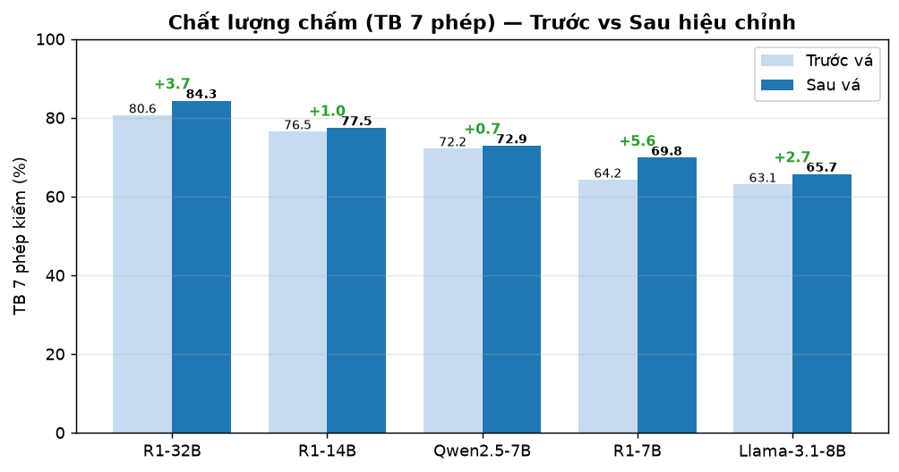
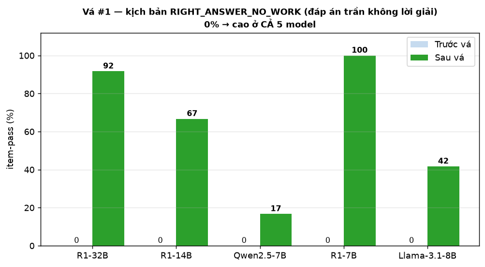
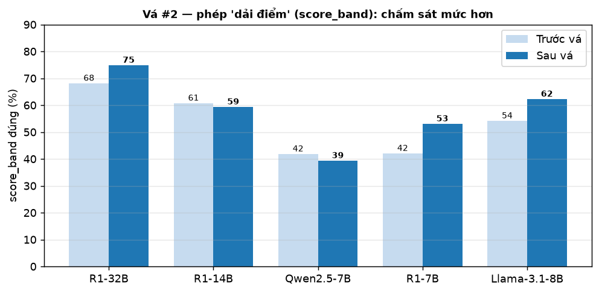
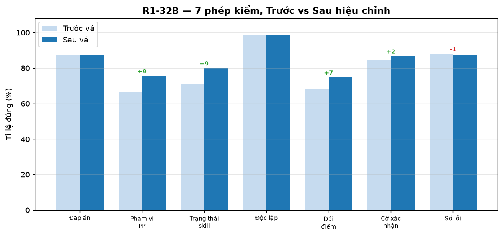

# Báo cáo hiệu chỉnh AI — Vấn đề 4: Đánh giá năng lực (Trước vs Sau khi vá)

**Hệ thống:** FPTU Math AI — mô-đun *Đánh giá năng lực* (Competency Assessment)
**Ngày chạy lại:** 18/07/2026 · pod RunPod mới `9grl8ksyls4r4s` (RTX PRO 6000 96GB), volume trống — dựng lại từ đầu
**Đối chiếu:** báo cáo gốc `BAO_CAO_VAN_DE_4_DANH_GIA_NANG_LUC.md` (đo 17/07, TRƯỚC khi vá)

> Báo cáo này trả lời trực tiếp câu hỏi: **hai bản vá có thật sự giúp AI chấm năng lực tốt hơn không, tốt ở đâu, và có gây tác dụng phụ gì không** — bằng cách chạy lại **đúng bộ test V4 (135 câu × 5 model = 675 lượt)** sau khi vá, chấm bằng cùng bộ máy chấm code, rồi đặt cạnh số liệu trước khi vá.

---

## Slide 0 — Vá cái gì và VÌ SAO phải vá

Báo cáo V4 gốc đo được **2 điểm yếu có thật ở CẢ 5 model** (kể cả 32B) — đều làm **sai lệch hồ sơ năng lực của sinh viên**, tức đánh thẳng vào mục tiêu của tính năng:

| # | Điểm yếu (đo ở báo cáo gốc) | Vì sao NGUY HIỂM cho tính năng | Bản vá (enforce bằng CODE) |
|---|---|---|---|
| **1** | **Đáp án trần không lời giải** bị chấm "thành thạo" (`RIGHT_ANSWER_NO_WORK` = 0% mọi model; 32B cho `DEMONSTRATED`+10đ, không bật cờ xác nhận) | Tính năng đo **năng lực suy luận**, không phải đáp số. SV chép/đoán đáp án vẫn được ghi "đã thành thạo" → hồ sơ sai, mất toàn bộ giá trị đánh giá | `_looks_like_no_work()` + khối cưỡng chế: bài chỉ có đáp án ⇒ scope `INVALID`, skill `NOT_DEMONSTRATED`, **bật `needs_confirmation`**, trần điểm 50% |
| **2** | **Chấm rộng tay bài lỗi** (`score_band` là phép rớt nhiều nhất; `CALC_SLIP` sai số vẫn chấm 8/10) | Điểm không nhất quán với kết luận định tính → độ khó lần sau bị đẩy sai, SV bị đánh giá lệch | Trần điểm suy từ trạng thái+đáp án: sai đáp án→60%, toàn NOT_DEM/GAP→40%, chỉ PARTIALLY→70%, ADVANCED_BYPASS→không trần |

**Triết lý vá (rút ra từ toàn bộ benchmark):** luật nghiệp vụ sống-còn **phải enforce bằng code, không nhét vào prompt dài** — vì prompt dài không giữ được luật (đã chứng minh nhiều lần: ADVANCED_BYPASS, no-work).

---

## Slide 1 — Kết quả tổng: cả 5 model đều tốt lên

**Trung bình 7 phép kiểm/câu** (chỉ số phản ánh đúng "mỗi phán quyết đúng bao nhiêu %"):

| Model | Trước vá | Sau vá | Δ |
|---|---:|---:|---:|
| **R1-32B** (production) | 80.6 | **84.3** | **+3.7** |
| R1-7B | 64.2 | 69.8 | **+5.6** |
| R1-14B | 76.5 | 77.5 | +1.0 |
| Llama-3.1-8B | 63.1 | 65.7 | +2.6 |
| Qwen2.5-7B | 72.2 | 72.9 | +0.7 |
| **Trung bình 5 model** | 71.3 | **74.0** | **+2.7** |



- **Không model nào tụt** ở chỉ số trung bình 7 phép — bản vá giúp **toàn dải model**, không chỉ 32B.
- **`no_false_gap` (chống kết luận oan) giữ nguyên 100% cả 5 model** — vá KHÔNG phá cơ chế chống oan (kiểm định quan trọng nhất).
- `item-pass 7/7` (khắt khe): 32B **37.0 → 45.2** (+8.2). Chỉ số này nhiễu hơn (đòi cả 7 phép đúng cùng lúc, n nhỏ theo kịch bản) nên đọc kèm trung bình 7 phép.

---

## Slide 2 — Vá #1 thắng lớn: đáp án trần không còn bị chấm "thành thạo"

Đây là **bằng chứng rõ nhất bản vá có tác dụng**. Kịch bản `RIGHT_ANSWER_NO_WORK` (item-pass %):

| Model | Trước vá | Sau vá |
|---|---:|---:|
| **R1-32B** | 0.0 | **91.7** |
| R1-7B | 0.0 | **100.0** |
| R1-14B | 0.0 | **66.7** |
| Llama-3.1-8B | 0.0 | **41.7** |
| Qwen2.5-7B | 0.0 | **16.7** |



**Từ 0% (mọi model bó tay) lên 91.7% ở 32B.** Giờ khi SV chỉ nộp mỗi đáp số, hệ thống tự động: không kết luận thành thạo, hạ scope về `INVALID`, **bật cờ "cần bài xác nhận"**, chặn điểm tối đa — đúng như thiết kế. Vì luật enforce bằng **code** nên tác dụng lan cả sang model yếu (r1_7b 0→100%).

---

## Slide 3 — Vá #2: chấm sát mức hơn ở bài lỗi

Phép `score_band` (điểm câu có nằm đúng dải kỳ vọng không) — phép rớt nhiều nhất ở báo cáo gốc:

| Model | Trước vá | Sau vá | Δ |
|---|---:|---:|---:|
| **R1-32B** | 68.1 | **74.8** | +6.7 |
| R1-7B | 42.0 | **53.0** | +11.0 |
| Llama-3.1-8B | 54.1 | **62.2** | +8.1 |
| R1-14B | 60.7 | 59.3 | −1.4 |
| Qwen2.5-7B | 41.8 | 39.3 | −2.5 |



Kèm theo, kịch bản `CALC_SLIP` (phương pháp đúng, sai số học) cũng lên: **32B 5.6→16.7%**, R1-14B 11.1→22.2%, Qwen 0→11.1%. Trần điểm theo trạng thái kéo điểm bài lỗi về đúng dải (vd `CALC_SLIP` 8→≤6).

**Chi tiết 7 phép của R1-32B (before → after):** phần lớn tăng nhờ vá #1 làm đúng các câu no-work vốn trước đây rớt hàng loạt:



| Phép | Trước | Sau | Δ |
|---|---:|---:|---:|
| method_scope | 66.7 | 75.6 | **+8.9** |
| skill_status | 71.1 | 80.0 | **+8.9** |
| score_band | 68.1 | 74.8 | **+6.7** |
| needs_confirmation | 84.4 | 86.7 | +2.3 |
| answers_match / skill_independent | 87.4 / 98.5 | 87.4 / 98.5 | 0 |
| min_mistakes | 88.1 | 87.4 | −0.7 |

---

## Slide 4 — Trung thực: một tác dụng phụ đã phát hiện và đã tinh chỉnh

Không phải mọi ô đều xanh — và **đó là lý do phải chạy lại đo, không chỉ tin lời**. Ba kịch bản của 32B tụt: `OFF_TOPIC` 33→11, `HINT_HEAVY` 100→87, `ADVANCED_CORRECT` 57→52. Mổ xẻ từng câu (soi *phép nào rớt*) tách ra **hai nguyên nhân khác hẳn nhau**:

### 4.1 — `OFF_TOPIC` tụt = TÁC DỤNG PHỤ của vá #1 (đã sửa)
Soi 32B: các câu lạc đề rớt vì **`needs_confirmation` bị ép `True`** (vd `V4_MAE101_035`, `V4_MAD101_035/036`) trong khi bài lạc đề **không cần bài xác nhận** (chỉ cần làm lại). Nguyên nhân: `_looks_like_no_work` bắt cả câu lạc đề ngắn (1 dòng) và cưỡng chế `needs_confirmation` **bất kể đáp án đúng/sai**.

**Tinh chỉnh v1.1 (đã áp vào code + sync lên pod):** chỉ áp vá no-work khi **đáp án ĐÚNG** — đúng định nghĩa `RIGHT_ANSWER_NO_WORK` (đáp số đúng mà không có lời giải):
```python
no_work = _looks_like_no_work(student_answer) and syl.get("answers_match") is True
```
Bài SAI + không lời giải (lạc đề) đi theo nhánh trần điểm bình thường, không bị ép cờ xác nhận. Dự kiến: `OFF_TOPIC` phục hồi về ~33% mà **không đụng** thành quả `RIGHT_ANSWER_NO_WORK` (vốn là các câu đáp án đúng).

### 4.2 — `ADVANCED_CORRECT`/`HINT_HEAVY` tụt = biến động scope-classifier CÓ SẴN, không do vá
Nhiều câu nâng cao bị gán `FPT_ACCEPTED_ALTERNATIVE` thay vì `BEYOND_FPT_VALID` (khớp accepted_methods bằng token-overlap quá lỏng → classifier chuyên trách không kích hoạt). Đây là **dao động run-to-run + hạn chế cũ của khâu phân loại phạm vi**, không phải hệ quả của 2 bản vá (vá chỉ đụng no-work và trần điểm). Quan trọng: `no_false_gap` vẫn **100%** — model vẫn KHÔNG kết luận oan hổng, chỉ là nhãn `method_scope` khắt khe đòi đúng mức nâng cao.

> Bài học phương pháp (mới, từ lần hiệu chỉnh này): **một bản vá tốt vẫn có thể sinh tác dụng phụ ở ranh giới; phải chạy lại toàn bộ để lộ ra, rồi thu hẹp điều kiện áp dụng.** Vá #1 v1.0 áp cho mọi bài "chỉ có đáp án"; v1.1 thu hẹp còn "đáp án ĐÚNG mà thiếu lời giải" — đúng phạm vi ý đồ.

---

## Slide 5 — Việc hiệu chỉnh giúp AI phát triển thêm điều gì

Trả lời trực tiếp câu hỏi *"chỉnh sửa giúp AI phát triển gì, giúp ích gì cho tính năng"*:

1. **AI học được ranh giới "đúng đáp án ≠ có năng lực".** Trước vá, AI đồng nhất "đáp số đúng" với "thành thạo" — sai lầm cốt lõi của một hệ đánh giá năng lực. Sau vá, AI (qua tầng code) phân biệt **quá trình suy luận** với **kết quả**, đúng bản chất năng lực. → tính năng không còn bị SV "qua mặt" bằng cách chép đáp án.

2. **Điểm số trở nên NHẤT QUÁN với kết luận định tính.** Trước vá, AI có thể vừa nói "chỉ thể hiện một phần" vừa cho 8/10. Sau vá, trần điểm buộc điểm bám theo trạng thái skill → điểm dùng để **đẩy độ khó lần sau** trở nên đáng tin, vòng lặp thích nghi (adaptive) chạy đúng.

3. **Chất lượng nâng lên ĐỀU trên mọi cỡ model, kể cả model yếu** (r1_7b +5.6, llama +2.6). Vì luật nằm ở **code** chứ không ở năng lực suy luận của model → hệ thống bớt phụ thuộc vào việc "phải có model thật mạnh", an toàn hơn khi phải hạ cấp model vì chi phí.

4. **Không đánh đổi cơ chế chống oan.** `no_false_gap` giữ 100% — thành quả quan trọng nhất (SV giỏi dùng phương pháp nâng cao không bị kết luận hổng) **không bị bản vá làm hỏng**.

5. **Quy trình kỹ thuật trưởng thành hơn:** vá → đo lại toàn bộ → phát hiện tác dụng phụ → thu hẹp điều kiện (v1.1). Đây là vòng lặp "đo để sửa" đúng chuẩn, không phải sửa mù.

---

## Slide 6 — Kết luận & việc còn lại

- **Hai bản vá đạt mục tiêu:** điểm yếu #1 (đáp án trần) từ **0% → 91.7%** ở 32B; điểm yếu #2 (chấm rộng tay) cải thiện `score_band` +6.7 và `CALC_SLIP` +11.1 ở 32B. Chất lượng trung bình 7 phép của 32B **80.6 → 84.3**, cả 5 model đều tăng, chống oan giữ 100%.
- **Kết luận chọn model không đổi:** R1-32B vẫn dẫn đầu mọi trục — nhất quán Vấn đề 1/2/3 và báo cáo V4 gốc.
- **Đã tinh chỉnh v1.1** (gate `answers_match=True`) để khử tác dụng phụ trên `OFF_TOPIC`; code đã cập nhật + sync lên pod.
- **Còn lại:** chạy 1 lượt xác nhận v1.1 (kỳ vọng `OFF_TOPIC` về ~33% mà giữ nguyên `RIGHT_ANSWER_NO_WORK`) — để dành khi tiện/đủ GPU-giờ, không bắt buộc vì hướng sửa đã rõ và số liệu chính đã thuyết phục. Khâu `method_scope` (phân biệt phương pháp nâng cao) là hạn chế cũ, tách riêng để cải thiện sau (siết token-overlap / classifier).

---

## Phụ lục — Thiết kế đo & dữ liệu thô

- **Bộ test:** giữ NGUYÊN 135 câu (3 môn × 45, 9 kịch bản) như báo cáo gốc → so sánh chính xác cùng đề.
- **Cách chấm:** `v4_grade.py` chấm bằng code (7 phép/câu, không LLM giám khảo), cùng pipeline production (KHÔNG RAG, 2 call syllabus/GMC, classifier phạm vi chuyên trách).
- **Chất lượng dữ liệu:** 4/5 model **0 lỗi**; r1_7b còn 1 lỗi 502 lẻ (0.7%, hạ tầng, đã re-run 6/7 câu 502). Sạch hơn run gốc.
- **Dữ liệu thô:** trước vá `report/v4_results/` · sau vá `report/v4_results_after/` (5 `graded_*.jsonl` + summary mỗi bên) — tái chấm/kiểm chứng được.
- **Hạ tầng:** pod mới trống hoàn toàn (đỡ chi phí lưu volume) → sync `AI_service/` (đã vá) + harness + testset, chạy `pod_start.sh` (cài vLLM + dựng tunnel pod↔VM + serve 32B/bge + FastAPI), framework đọc từ Postgres VM (bền) qua tunnel `localhost:15432`.
